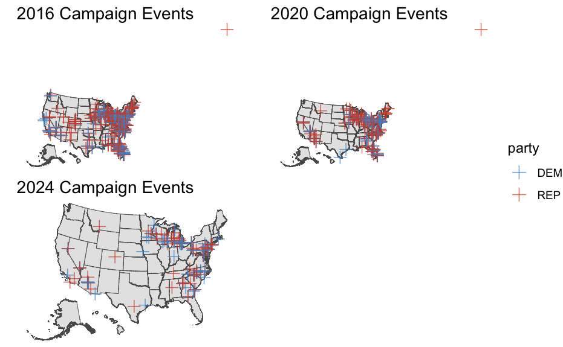

# **Week 7: Ground Game**

**Monday, October 21, 2024**\
**14 Days until Presidential Election**

*Two more weeks until election day! Right now, both candidates are engaging in last-ditch efforts to attract undecided voters. Trump and Harris are jumping between battleground states (and other key electorates) holding media appearances, rallies, fund-raisers, and other campaign events. [The New York Times](https://www.nytimes.com/interactive/2024/10/16/us/politics/harris-trump-2024-campaign.html) reports that Harris has campaigned at 39 events since September 1st while Trump has campaigned at 59. Whether this discrepancy will have an effect on vote share will be the focus of this week's post.*

```{r include=FALSE}
####----------------------------------------------------------#
#### Preamble
####----------------------------------------------------------#

# Load libraries.
## install via `install.packages("name")`
library(geofacet)
library(ggpubr)
library(ggthemes)
library(haven)
library(kableExtra)
library(maps)
library(mgcv)
library(mgcViz)
library(RColorBrewer)
library(scales)
library(sf)
library(spData)
library(stargazer)
library(tidygeocoder)
library(tidyverse)
library(tigris)
library(tmap)
library(tmaptools)
library(viridis)
library(modelsummary)

## Import custom themes
map_theme <- function() {
  theme(
    # no border
    panel.border = element_blank(),
    # background
    panel.background = element_rect(fill = "snow2"),
    # text
    plot.title = element_text(size = 15, hjust = .5, face = "bold", family = "sans"),
    plot.subtitle = element_text(size = 13, hjust = .5, family = "sans"),
    plot.title.position = "panel",
    axis.text.x = element_text(size = 8, angle = 45, hjust = .5, family = "sans"),
    axis.text.y = element_text(size = 8, family = "sans"),
    axis.title.x = element_text(family = "sans"),
    axis.title.y = element_text(angle = 90, family = "sans"),
    axis.ticks = element_line(colour = "black"),
    axis.line = element_line(colour = "grey"),
    # legend 
    legend.position = "right",
    legend.title = element_text(size = 12, family = "sans"),
    legend.text = element_text(size = 10, family = "sans"),
    # aspect ratio
    aspect.ratio = .8
  )
}
plot_date_theme <- function() {
  theme(
    # no border
    panel.border = element_blank(),
    # background
    panel.background = element_rect(fill = "snow2"),
    # text
    plot.title = element_text(size = 15, hjust = .5, face = "bold", family = "sans"),
    plot.subtitle = element_text(size = 13, hjust = .5, family = "sans"),
    plot.title.position = "panel",
    axis.text.x = element_text(size = 8, family = "sans"),
    axis.text.y = element_text(size = 8, family = "sans"),
    axis.title.x = element_text(family = "sans"),
    axis.title.y = element_text(angle = 90, family = "sans"),
    axis.ticks = element_line(colour = "black"),
    axis.line = element_line(colour = "grey"),
    # legend 
    legend.position = "right",
    legend.title = element_text(size = 12, family = "sans"),
    legend.text = element_text(size = 10, family = "sans"),
  )
}
plot_theme <- function() {
  theme(
    # no border
    panel.border = element_blank(),
    # background
    panel.background = element_rect(fill = "snow2"),
    # text
    plot.title = element_text(size = 15, hjust = .5, face = "bold", family = "sans"),
    plot.subtitle = element_text(size = 13, hjust = .5, family = "sans"),
    plot.title.position = "panel",
    axis.text.x = element_text(size = 8, family = "sans"),
    axis.text.y = element_text(size = 8, family = "sans"),
    axis.title.x = element_text(family = "sans"),
    axis.title.y = element_text(angle = 90, family = "sans"),
    axis.ticks = element_line(colour = "black"),
    axis.line = element_line(colour = "grey"),
    # legend 
    legend.position = "right",
    legend.title = element_text(size = 12, family = "sans"),
    legend.text = element_text(size = 10, family = "sans"),
  )
}
my_prettier_theme <- function() {
  theme(
    # no border
    panel.border = element_blank(),
    # background
    panel.background = element_rect(fill = "snow2"),
    # text
    plot.title = element_text(size = 15, hjust = .5, face = "bold", family = "sans"),
    plot.subtitle = element_text(size = 13, hjust = .5, family = "sans"),
    plot.title.position = "panel",
    axis.text.x = element_text(size = 8, angle = 90, hjust = .5, family = "sans"),
    axis.text.y = element_text(size = 8, family = "sans"),
    axis.title.x = element_text(family = "sans"),
    axis.title.y = element_text(angle = 90, family = "sans"),
    axis.ticks = element_line(colour = "black"),
    axis.line = element_line(colour = "grey"),
    # legend 
    legend.position = "right",
    legend.title = element_text(size = 12, family = "sans"),
    legend.text = element_text(size = 10, family = "sans"),
    # aspect ratio
    # aspect.ratio = .8
  )
}
```

```{r include=FALSE}
####----------------------------------------------------------#
#### Read, merge, and process data. -- Code by Matthew Dardet
####----------------------------------------------------------#

# Read popular vote datasets. 
d_popvote <- read_csv("popvote_1948_2020.csv")
d_state_popvote <- read_csv("state_popvote_1948_2020.csv")
d_state_popvote[d_state_popvote$state == "District of Columbia",]$state <- "District Of Columbia"

# Read elector distribution dataset. 
d_ec <- read_csv("corrected_ec_1948_2024.csv")

# Read polling data. 
d_polls <- read_csv("national_polls_1968-2024.csv")
d_state_polls <- read_csv("state_polls_1968-2024.csv")

# Process state-level polling data. 
d_pollav_state <- d_state_polls |> 
  group_by(year, state, party) |>
  mutate(mean_pollav = mean(poll_support, na.rm = TRUE)) |>
  top_n(1, poll_date) |> 
  rename(latest_pollav = poll_support) |>
  select(-c(weeks_left, days_left, poll_date, candidate, before_convention)) |>
  pivot_wider(names_from = party, values_from = c(latest_pollav, mean_pollav))

# Read turnout data. 
d_turnout <- read_csv("state_turnout_1980_2022.csv")

# Read county turnout. 
d_county_turnout <- read_csv("county_turnout.csv")

# Read state-level demographics.
d_state_demog <- read_csv("demographics.csv")

# Read county demographics. 
d_county_demog <- read_csv("county_demographics.csv")

# Read campaign events datasets. 
d_campaign_events <- read_csv("campaigns_2016_2024.csv")[,-1]

# Read economic data.
d_econ <- read_csv("fred_econ.csv", show_col_types = FALSE) |> 
  filter(quarter == 2)

# Read campaign spending
d_campaign_spending <- read_csv("FEC_contributions_by_state_2008_2024.csv", show_col_types = FALSE)

# Read turnout data
d_state_turnout <- read_csv("state_turnout_1980_2022.csv", show_col_types = FALSE)
d_state_turnout <- d_state_turnout |> 
  mutate(vep_turnout = as.numeric(str_remove(vep_turnout, "%"))/100) |> 
  select(year, state, vep_turnout)
```

## Binomial Logit Simulations and Probabilistic Models

```{r echo=FALSE, warning=FALSE}
####------------------------------------------------------------------------------#
#### Binomial simulations for election prediction. -- Code by Matthew Dardet
####------------------------------------------------------------------------------#

# # How many days until the election? 
# election.day <- as.Date("2024-11-05")
# current.date <- Sys.Date()
# 
# # election.day-current.date
# # 20 days!!!!!!

# Merge popular vote and polling data. 
d <- d_state_popvote |> 
  inner_join(d_state_polls |> filter(weeks_left == 3)) |> 
  mutate(state_abb = state.abb[match(state, state.name)])

# # Generate state-specific univariate poll-based forecasts with linear model.
# state_forecast <- list()
# state_forecast_outputs <- data.frame()
# for (s in unique(d$state_abb)) {
#   # Democrat model.
#   state_forecast[[s]]$dat_D <- d |> filter(state_abb == s, party == "DEM")
#   state_forecast[[s]]$mod_D <- lm(D_pv ~ poll_support, 
#                                   state_forecast[[s]]$dat_D)
#   
#   # Republican model.
#   state_forecast[[s]]$dat_R <- d |> filter(state_abb == s, party == "REP")
#   state_forecast[[s]]$mod_R <- lm(R_pv ~ poll_support, 
#                                   state_forecast[[s]]$dat_R)
#   
#   if (nrow(state_forecast[[s]]$dat_R) > 2) {
#     # Save state-level model estimates. 
#     state_forecast_outputs <- rbind(state_forecast_outputs, 
#                                     rbind(cbind.data.frame(
#                                       intercept = summary(state_forecast[[s]]$mod_D)$coefficients[1,1], 
#                                       intercept_se = summary(state_forecast[[s]]$mod_D)$coefficients[1,2],
#                                       slope = summary(state_forecast[[s]]$mod_D)$coefficients[2,1], 
#                                       state_abb = s, 
#                                       party = "DEM"), 
#                                     rbind(cbind.data.frame(
#                                      intercept = summary(state_forecast[[s]]$mod_R)$coefficients[1,1],
#                                      intercept_se = summary(state_forecast[[s]]$mod_R)$coefficients[1,2],
#                                      slope = summary(state_forecast[[s]]$mod_R)$coefficients[2,1],
#                                      state_abb = s,
#                                      party = "REP"
#                                     ))))
#   }
# }
# 
# # Make graphs of polls in different states/parties at different levels of strength/significance of outcome. 
# state_forecast_trends <- state_forecast_outputs |> 
#   mutate(`0` = intercept, 
#          `25` = intercept + slope*25, 
#          `50` = intercept + slope*50, 
#          `75` = intercept + slope*75, 
#          `100` = intercept + slope*100) |>
#   select(-intercept, -slope) |> 
#   gather(x, y, -party, -state_abb, -intercept_se) |> 
#   mutate(x = as.numeric(x))

# Q: What's wrong with this map? 
# A: (1.) no polls in some states
#    (2.) very high variance for some states (Nevada)/negative slopes for others (Mississippi)
#    (3.) y is not always in the [0, 100] range
# ggplot(state_forecast_trends, aes(x=x, y=y, ymin=y-intercept_se, ymax=y+intercept_se)) + 
#   facet_geo(~ state_abb) +
#   geom_line(aes(color = party)) + 
#   geom_ribbon(aes(fill = party), alpha=0.5, color=NA) +
#   coord_cartesian(ylim=c(0, 100)) +
#   scale_color_manual(values = c("blue", "red")) +
#   scale_fill_manual(values = c("blue", "red")) +
#   xlab("Hypothetical Poll Support") +
#   ylab("Predicted Voteshare\n(pv = A + B * poll)") +
#   ggtitle("") +
#   theme_bw()
# 
# state_forecast_trends |>
#   filter(state_abb == "CA" | state_abb == "FL")|>
#   ggplot(aes(x=x, y=y, ymin=y-intercept_se, ymax=y+intercept_se)) + 
#   facet_wrap(~ state_abb) +
#   geom_line(aes(color = party)) + 
#   geom_hline(yintercept = 100, lty = 3) +
#   geom_hline(yintercept = 0, lty = 3) + 
#   geom_ribbon(aes(fill = party), alpha=0.5, color=NA) +
#   ## N.B. You can, in fact, combine *different* data and aesthetics
#   ##       in one ggplot; but this usually needs to come at the end 
#   ##       and you must explicitly override all previous aesthetics
#   geom_text(data = d |> filter(state_abb == "CA", party=="DEM"), 
#             aes(x = poll_support, y = D_pv, ymin = D_pv, ymax = D_pv, color = party, label = year), size=1.5) +
#   geom_text(data = d |> filter(state_abb == "CA", party=="REP"), 
#             aes(x = poll_support, y = D_pv, ymin = D_pv, ymax = D_pv, color = party, label = year), size=1.5) +
#   geom_text(data = d |> filter(state_abb == "FL", party=="DEM"), 
#             aes(x = poll_support, y = D_pv, ymin = D_pv, ymax = D_pv, color = party, label = year), size=1.5) +
#   geom_text(data = d |> filter(state_abb == "FL", party=="REP"), 
#             aes(x = poll_support, y = D_pv, ymin = D_pv, ymax = D_pv, color = party, label = year), size=1.5) +
#   scale_color_manual(values = c("blue", "red")) +
#   scale_fill_manual(values = c("blue", "red")) +
#   xlab("Hypothetical Poll Support") +
#   ylab("Predicted Voteshare\n(pv = A + B * poll)") +
#   theme_bw()

# Merge turnout data into main dataset. 
d <- d |> 
  left_join(d_turnout, by = c("state", "year")) |> 
  filter(year >= 1980) # Filter to when turnout dataset begins. 

# # Generate probabilistic univariate poll-based state forecasts. 
state_glm_forecast <- list()
state_glm_forecast_outputs <- data.frame()
for (s in unique(d$state_abb)) {
  # Democrat model.
  state_glm_forecast[[s]]$dat_D <- d |> filter(state_abb == s, party == "DEM")
  state_glm_forecast[[s]]$mod_D <- glm(cbind(votes_D, vep - votes_D) ~ poll_support, # Cbind(N Success, N Total) for Binomial Model
                                      state_glm_forecast[[s]]$dat_D,
                                      family = binomial(link = "logit"))

  # Republican model.
  state_glm_forecast[[s]]$dat_R <- d |> filter(state_abb == s, party == "REP")
  state_glm_forecast[[s]]$mod_R <- glm(cbind(votes_R, vep - votes_R) ~ poll_support,
                                      state_glm_forecast[[s]]$dat_R,
                                      family = binomial(link = "logit"))

  if (nrow(state_glm_forecast[[s]]$dat_R) > 2) {
    for (hypo_avg_poll in seq(from = 0, to = 100, by = 10)) {
      # Democrat prediction.
      D_pred_vote_prob <- predict(state_glm_forecast[[s]]$mod_D,
                                  newdata = data.frame(poll_support = hypo_avg_poll), se = TRUE, type = "response")
      D_pred_qt <- qt(0.975, df = df.residual(state_glm_forecast[[s]]$mod_D)) # Used in the prediction interval formula.

      # Republican prediction.
      R_pred_vote_prob <- predict(state_glm_forecast[[s]]$mod_R,
                                  newdata = data.frame(poll_support = hypo_avg_poll), se = TRUE, type = "response")
      R_pred_qt <- qt(0.975, df = df.residual(state_glm_forecast[[s]]$mod_R)) # Used in the prediction interval formula.

      # Save predictions.
      state_glm_forecast_outputs <- rbind(state_glm_forecast_outputs,
                                          cbind.data.frame(x = hypo_avg_poll,
                                                           y = D_pred_vote_prob$fit*100,
                                                           ymin = (D_pred_vote_prob$fit - D_pred_qt*D_pred_vote_prob$se.fit)*100,
                                                           ymax = (D_pred_vote_prob$fit + D_pred_qt*D_pred_vote_prob$se.fit)*100,
                                                           state_abb = s,
                                                           party = "DEM"),
                                          cbind.data.frame(x = hypo_avg_poll,
                                                           y = R_pred_vote_prob$fit*100,
                                                           ymin = (R_pred_vote_prob$fit - R_pred_qt*R_pred_vote_prob$se.fit)*100,
                                                           ymax = (R_pred_vote_prob$fit + R_pred_qt*R_pred_vote_prob$se.fit)*100,
                                                           state_abb = s,
                                                           party = "REP"))
    }
  }
}

# Make graphs of polls in different states/parties at different levels of strength/significance of outcome. 
ggplot(state_glm_forecast_outputs, aes(x=x, y=y, ymin=ymin, ymax=ymax)) + 
  facet_geo(~ state_abb) +
  geom_line(aes(color = party)) + 
  geom_ribbon(aes(fill = party), alpha=0.5, color=NA) +
  coord_cartesian(ylim=c(0, 100)) +
  scale_color_manual(values = c("steelblue3", "tomato3")) +
  scale_fill_manual(values = c("steelblue3", "tomato3")) +
  xlab("Hypothetical Poll Support") +
  ylab('Probability of State-Eligible Voter Voting for Party') +
  plot_theme()

state_glm_forecast_outputs |>
  filter(state_abb == "GA" | state_abb == "NC") |>
  ggplot(aes(x=x, y=y, ymin=ymin, ymax=ymax)) + 
  facet_wrap(~ state_abb) +
  geom_line(aes(color = party)) + 
  geom_ribbon(aes(fill = party), alpha=0.5, color=NA) +
  coord_cartesian(ylim=c(0, 100)) +
  geom_text(data = d |> filter(state_abb == "GA", party=="DEM"), 
            aes(x = poll_support, y = D_pv, ymin = D_pv, ymax = D_pv, color = party, label = year), size=1.5) +
  geom_text(data = d |> filter(state_abb == "GA", party=="REP"), 
            aes(x = poll_support, y = D_pv, ymin = D_pv, ymax = D_pv, color = party, label = year), size=1.5) +
  geom_text(data = d |> filter(state_abb == "NC", party=="DEM"), 
            aes(x = poll_support, y = D_pv, ymin = D_pv, ymax = D_pv, color = party, label = year), size=1.5) +
  geom_text(data = d |> filter(state_abb == "NC", party=="REP"), 
            aes(x = poll_support, y = D_pv, ymin = D_pv, ymax = D_pv, color = party, label = year), size=1.5) +
  scale_color_manual(values = c("steelblue3", "tomato3")) +
  scale_fill_manual(values = c("steelblue3", "tomato3")) +
  xlab("Hypothetical Poll Support") +
  ylab('Probability of\nState-Eligible Voter\nVoting for Party') +
  ggtitle("Binomial Logit") + 
  theme_bw() + 
  theme(axis.title.y = element_text(size=6.5))

# Simulating a distribution of potential election results in Georgia for 2024. 
# First step. Let's use GAM (general additive model) to impute VEP in Pennsylvania for 2024 using historical VEP.

# Get historical eligible voting population in Georgia
vep_GA_2020 <- as.integer(d_turnout$vep[d_turnout$state == "Georgia" & d_turnout$year == 2020])
vep_GA <- d_turnout |> filter(state == "Georgia") |> select(vep, year)

# Fit regression for 2024 VEP prediction.
lm_vep_GA <- lm(vep ~ year, vep_GA)

plot(x = vep_GA$year, y = vep_GA$vep, xlab = "Year", ylab = "VEP", main = "Voting Eligible Population in Georgia by Year")
abline(lm_vep_GA, col = "tomato3")
# 
vep_GA_2024_ols <- predict(lm_vep_GA, newdata = data.frame(year = 2024)) |> as.numeric()
# 
gam_vep_GA <- mgcv::gam(vep ~ s(year), data = vep_GA)
# print(plot(getViz(gam_vep_GA)) + l_points() + l_fitLine(linetype = 3) + l_ciLine(colour = 2) + theme_get()) 

# Use generalized additive model (GAM) to predict 2024 VEP in GA
vep_GA_2024_gam <- predict(gam_vep_GA, newdata = data.frame(year = 2024)) |> as.numeric()

# Take weighted average of linear and GAM predictions for final prediction. 
vep_GA_2024 <- as.integer(0.75*vep_GA_2024_gam + 0.25*vep_GA_2024_ols)
vep_GA_2024

# Split datasets by party. 
GA_D <- d |> filter(state == "Georgia" & party == "DEM")
GA_R <- d |> filter(state == "Georgia" & party == "REP")

# Fit Democrat and Republican models. 
GA_D_glm <- glm(cbind(votes_D, vep - votes_D) ~ poll_support, data = GA_D, family = binomial(link = "logit"))
GA_R_glm <- glm(cbind(votes_R, vep - votes_R) ~ poll_support, data = GA_R, family = binomial(link = "logit"))

# Get predicted draw probabilities for D and R. 
(GA_pollav_D <- d_state_polls$poll_support[d_state_polls$state == "Georgia" & d_state_polls$weeks_left == 3 & d_state_polls$party == "DEM"] |> mean(na.rm = T))
(GA_pollav_R <- d_state_polls$poll_support[d_state_polls$state == "Georgia" & d_state_polls$weeks_left == 3 & d_state_polls$party == "REP"] |> mean(na.rm = T))
(GA_sdpoll_D <- sd(d_state_polls$poll_support[d_state_polls$state == "Georgia" & d_state_polls$weeks_left == 3 & d_state_polls$party == "DEM"] |> na.omit()))
(GA_sdpoll_R <- sd(d_state_polls$poll_support[d_state_polls$state == "Georgia" & d_state_polls$weeks_left == 3 & d_state_polls$party == "REP"] |> na.omit()))

(prob_D_vote_GA_2024 <- predict(GA_D_glm, newdata = data.frame(poll_support = GA_pollav_D), se = TRUE, type = "response")[[1]] |> as.numeric())
(prob_R_vote_GA_2024 <- predict(GA_R_glm, newdata = data.frame(poll_support = GA_pollav_R), se = TRUE, type = "response")[[1]] |> as.numeric())

# Get predicted distribution of draws from the population. 
sim_D_votes_GA_2024 <- rbinom(n = 10000, size = vep_GA_2024, prob = prob_D_vote_GA_2024)
sim_R_votes_GA_2024 <- rbinom(n = 10000, size = vep_GA_2024, prob = prob_R_vote_GA_2024)

# Simulating a distribution of election results: Harris GA PV. 
hist(sim_D_votes_GA_2024, breaks = 100, col = "steelblue3", main = "Predicted Turnout Draws for Harris \n from 10,000 Binomial Process Simulations")

# Simulating a distribution of election results: Trump GA PV. 
hist(sim_R_votes_GA_2024, breaks = 100, col = "tomato3", main = "Predicted Turnout Draws for Trump \n from 10,000 Binomial Process Simulations")

# Simulating a distribution of election results: Trump win margin. 
sim_elxns_GA_2024 <- ((sim_R_votes_GA_2024-sim_D_votes_GA_2024)/(sim_D_votes_GA_2024 + sim_R_votes_GA_2024))*100
hist(sim_elxns_GA_2024, breaks = 100, col = "tomato3", main = "Predicted Draws of Win Margin for Trump \n from 10,000 Binomial Process Simulations", xlim = c(4.4, 4.75))

# Simulations incorporating prior for SD. 
sim_D_votes_GA_2024_2 <- rbinom(n = 10000, size = vep_GA_2024, prob = rnorm(10000, GA_pollav_D/100, GA_sdpoll_D/100))
sim_R_votes_GA_2024_2 <- rbinom(n = 10000, size = vep_GA_2024, prob = rnorm(10000, GA_pollav_R/100, GA_sdpoll_R/100))
sim_elxns_GA_2024_2 <- ((sim_R_votes_GA_2024_2-sim_D_votes_GA_2024_2)/(sim_D_votes_GA_2024_2 + sim_R_votes_GA_2024_2))*100
h <- hist(sim_elxns_GA_2024_2, breaks = 100, col = "tomato3")
cuts <- cut(h$breaks, c(-Inf, 0, Inf))
plot(h, yaxt = "n", bty = "n", xlab = "", ylab = "", main = "Fluctuation Simulation of Voter from VEP Voting for a Party", sub="Using Priors as Standard Deviations of Polls", xlim = c(-40, 40), col = c("steelblue3", "tomato3")[cuts], cex.axis=0.8)
```

Up until this point, I have generally been using linear regression models to predict party vote shares and turnout. As we have seen through the weeks, there are a couple problems that consistently appear. Total vote shares can add up to over 100%, but binomial logit regressions ensure that outcomes stick within a certain 0-1 threshold. What's more, binomial logit regressions are strong in showing the odds of one outcome over another, which is most helpful in determining who is most likely to win an election.

The above charts demonstrate the relationship between hypothetical poll support for each party in each state with the probability of state-eligible voter voting for party. We can compare North Carolina and Georgia and see that there exist two different non-linear relationships across the states. In Georgia, as poll support for both Democrats and Republicans increase, the probability of state-eligible voter voting for the respective party increases relatively gradually. In North Carolina, as poll support for Democrats increase, the probability of state-eligible voter voting for Democrats increases dramatically (the relationship for Republicans appears more gradual and linear).

In Georgia, my home state, the voting eligible population increases linearly with each year.

The distribution of predicted draws on the win margin for Trump in Georgia shows a firm lead with a range of around 4 points in his favor.

We have simulated fluctuations in the probability of a voter from the voting eligible population voting for a party by using a prior at the standard deviation of its polls. This distribution demonstrates an incredibly close race between Harris and Trump but a skew toward Trump, suggesting a Trump victory.

## Field Offices and Campaign Events

```{r echo=FALSE, message=FALSE, warning=FALSE}
####----------------------------------------------------------#
#### Ground Game: Field offices and campaign events. 
####----------------------------------------------------------#

# Where should campaigns build field offices? 
fo_2012 <- read_csv("fieldoffice_2012_bycounty.csv", show_col_types = FALSE)

lm_obama <- lm(obama12fo ~ romney12fo + 
                 swing + 
                 core_rep + 
                 swing:romney12fo + 
                 core_rep:romney12fo + 
                 battle + 
                 medage08 + 
                 pop2008 + 
                 pop2008^2 + 
                 medinc08 + 
                 black + 
                 hispanic + 
                 pc_less_hs00 + 
                 pc_degree00 + 
                 as.factor(state), 
               fo_2012)

lm_romney <- lm(romney12fo ~ 
                  obama12fo + 
                  swing + 
                  core_dem + 
                  swing:obama12fo + 
                  core_dem:obama12fo + 
                  battle + 
                  medage08 + 
                  pop2008 + 
                  pop2008^2 + 
                  medinc08 + 
                  black + 
                  hispanic + 
                  pc_less_hs00 + 
                  pc_degree00 + 
                  as.factor(state),
                  fo_2012)

modelsummary(list(lm_obama, lm_romney), title = "Obama Romney Field Offices")

# Effects of field offices on turnout and vote share. 
fo_dem <- read_csv("fieldoffice_2004-2012_dems.csv", show_col_types = FALSE)

ef_t <- lm(turnout_change ~ dummy_fo_change + battle + dummy_fo_change:battle + as.factor(state) + as.factor(year), fo_dem)

ef_d <- lm(dempct_change ~ dummy_fo_change + battle + dummy_fo_change:battle + as.factor(state) + as.factor(year), fo_dem)

modelsummary(list(ef_t, ef_d), title = "Effects of Field Offices on Turnout and Vote Share")
# Field Strategies of Obama, Romney, Clinton, and Trump in 2016. 
fo_add <- read_csv("fieldoffice_2012-2016_byaddress.csv", show_col_types = FALSE)

trump_fo_count <- fo_add |>
  filter(candidate == "Trump") |>
  count()
clinton_fo_count <- fo_add |>
  filter(candidate == "Clinton") |>
  count()
romney_fo_count <- fo_add |>
  filter(candidate == "Romney") |>
  count()
obama_fo_count <- fo_add |>
  filter(candidate == "Obama") |>
  count()

fo_count_comp <- data.frame(trump_fo_count, clinton_fo_count, romney_fo_count, obama_fo_count)

colnames(fo_count_comp) <- c("Trump Field Offices", "Clinton Field Offices", "Romney Field Offices", "Obama Field Offices")

kable(fo_count_comp)
# Visualizing campaign events. 
d_campaign_events$party[d_campaign_events$candidate %in% c("Trump / Pence", "Trump", "Pence", "Trump/Pence", "Vance")] <- "REP"
d_campaign_events$party[d_campaign_events$candidate %in% c("Biden / Harris", "Biden", "Harris", "Biden/Harris", "Walz", "Kaine", "Clinton", "Clinton / Kaine")] <- "DEM"
p.ev.1 <- d_campaign_events |> group_by(date, party) |> summarize(n_events = n(), year) |> filter(year == 2016) |> ggplot(aes(x = date, y = n_events, color = party)) + geom_point()+ scale_color_manual(values = c("steelblue3", "tomato3")) + geom_smooth() + ggtitle("2016") + plot_date_theme()
p.ev.2 <- d_campaign_events |> group_by(date, party) |> summarize(n_events = n(), year) |> filter(year == 2020) |> ggplot(aes(x = date, y = n_events, color = party)) + geom_point() + scale_color_manual(values = c("steelblue3", "tomato3")) + geom_smooth() + ggtitle("2020") +  plot_date_theme()
p.ev.3 <- d_campaign_events |> group_by(date, party) |> summarize(n_events = n(), year) |> filter(year == 2024) |> ggplot(aes(x = date, y = n_events, color = party)) + geom_point() + scale_color_manual(values = c("steelblue3", "tomato3")) + geom_smooth() + ggtitle("2024") + plot_date_theme() 

ggarrange(p.ev.1, p.ev.2, p.ev.3)
```

For now, we return to linear regressions to the evaluate the relationship between states and demographics and the presence of field offices for the Obama (Model 1) and Romney (Model 2) campaigns in 2012. The Obama model shows that, on average, for every field office that Romney had, Obama had about 2.5. The Obama and Romney campaigns also were more likely to have field offices in counties with higher educational degree attainment. The Obama campaign was more likely to have field offices in counties with higher percentages of less-than-high-school levels of educational attainment than the Romney campaign. We could analyze the relationships between these campaigns and the demographics of the counties they exist in endlessly, but these models are useful in giving color to the idea that the decision of setting up a field office in a certain district is intentional.

In another set of models, we can evaluate the effects of the presence of field offices on turnout (Model 1) and Democratic vote share (Model 2). On average, Democratic vote share and turnout were marginalyl higher in the counties of battleground states with field offices. We can also see the discrepancy in the sheer number of field offices between 2012 and 2016 campaigns; the Democratic candidates, Clinton and Obama, had far more field offices than their Republican opponents

```{r include=FALSE}
# Mapping campaign events. 
# d_campaign_events <- d_campaign_events |>
#   geocode(city = city, state = state, method = 'osm', lat = latitude , long = longitude)
# Code commented out to reduce computation time
d_campaign_events <- read_csv("campaign_events_geocoded.csv", show_col_types = FALSE)
d_campaign_events$party[d_campaign_events$candidate %in% c("Trump / Pence", "Trump", "Pence", "Trump/Pence", "Vance")] <- "REP"
d_campaign_events$party[d_campaign_events$candidate %in% c("Biden / Harris", "Biden", "Harris", "Biden/Harris", "Walz", "Kaine", "Clinton", "Clinton / Kaine")] <- "DEM"
```

```{r echo=FALSE}
# us_geo <- states(cb = TRUE) |>
#   shift_geometry() |>
#   filter(STUSPS %in% unique(fo_add$state))
# 
# d_ev_transformed <- st_as_sf(d_campaign_events |> drop_na(), coords = c("longitude", "latitude"), crs = 4326) |>
#   st_transform(crs = st_crs(us_geo)) |>
#   shift_geometry() |>
#   st_make_valid()
# ev16 <- ggplot() +
#    geom_sf(data = us_geo) +
#    geom_sf(data = d_ev_transformed |> filter(year == 2016), aes(color = party), size = 3, alpha = 0.75, pch = 3) +
#    ggtitle("2016 Campaign Events") +
#   scale_color_manual(values = c("steelblue3", "tomato3")) +
#    theme_void()
# 
# ev20 <- ggplot() +
#    geom_sf(data = us_geo) +
#    geom_sf(data = d_ev_transformed |> filter(year == 2020), aes(color = party), size = 3, alpha = 0.75, pch = 3) +
#    ggtitle("2020 Campaign Events") +
#   scale_color_manual(values = c("steelblue3", "tomato3")) +
#    theme_void()
# 
# ev24 <- ggplot() +
#    geom_sf(data = us_geo) +
#    geom_sf(data = d_ev_transformed |> filter(year == 2024), aes(color = party), size = 3, alpha = 0.75, pch = 3) +
#    ggtitle("2024 Campaign Events") +
#   scale_color_manual(values = c("steelblue3", "tomato3")) +
#    theme_void()
# 
# ggarrange(ev16, ev20, ev24,
#           nrow = 2, ncol = 2,
#           heights = c(1, 1),  # Ensure all rows have the same height
#           widths = c(1, 1),
#           align = "hv",  # Align horizontally and vertically
#           common.legend = TRUE, legend = "right")

# Can the number of campaign events predict state-level vote share?
d_ev_state <- d_campaign_events |>
  group_by(year, state, party) |>
  summarize(n_events = n()) |>
  pivot_wider(names_from = party, values_from = n_events) |>
  rename(n_ev_D = DEM, n_ev_R = REP)
d_ev_state$n_ev_D[which(is.na(d_ev_state$n_ev_D))] <- 0
d_ev_state$n_ev_R[which(is.na(d_ev_state$n_ev_R))] <- 0
d_ev_state$ev_diff_D_R <- d_ev_state$n_ev_D - d_ev_state$n_ev_R
d_ev_state$ev_diff_R_D <- d_ev_state$n_ev_R - d_ev_state$n_ev_D

d <- d |> 
left_join(d_ev_state, by = c("year", "state_abb" = "state"))

lm_ev_D <- lm(D_pv2p ~ n_ev_D + ev_diff_D_R, data = d)
lm_ev_R <- lm(R_pv2p ~ n_ev_R + ev_diff_R_D, data = d)
# 
# summary(lm_ev_D)
# summary(lm_ev_R)

modelsummary(list(lm_ev_D, lm_ev_R), title ="Can the number of campaign events predict state-level vote share?")
```



The above maps visualize the locations of various campaign events held for Democrats and Republicans across the current and past two elections. Across all three maps, we see a concentration of events in the Northeast region of the country. We also see how from 2016 to 2024, the number of events greatly diminishes in Florida; this could likely be to the fact that it is now considered much less of a swing state than it used to be. There are fewer events on the whole in 2020 because of the pandemic. By 2024, the campaign events occur either entirely in battleground states or major fundraising centers for each party (e.g. New York and California for the Democrats).

Take a look at the summary statistics of the model that we created to predict vote share based on the number of campaign events, and you will find pretty large coefficients for the Democrats when they have more events over Republicans (Model 1) and for the Repbulicans when they are the ones that possess the positive margin. This predictive power is quickly humbled by an abysmal R-Squared value. I decide to leave the number of campaign events out of my forecasting model for this reason.

```{r include=FALSE}
# Read popular vote datasets. 
d_popvote <- read_csv("popvote_1948_2020.csv")
d_state_popvote <- read_csv("state_popvote_1948_2020.csv")

# Read elector distribution dataset. 
d_ec <- read_csv("corrected_ec_1948_2024.csv") |>
  filter(year == "2024")

# Read ads datasets. 
campaign_spending <- read_csv("FEC_contributions_by_state_2008_2024.csv")

# Read polling data. 
d_polls <- read_csv("national_polls_1968-2024.csv")
d_state_polls <- read_csv("state_polls_1968-2024.csv")

# Process state-level polling data. 
d_pollav_state <- d_state_polls |> 
  group_by(year, state, party) |>
  mutate(mean_pollav = mean(poll_support, na.rm = TRUE)) |>
  top_n(1, poll_date) |> 
  rename(latest_pollav = poll_support) |>
  select(-c(weeks_left, days_left, poll_date, candidate, before_convention)) |>
  pivot_wider(names_from = party, values_from = c(latest_pollav, mean_pollav))

# Read turnout data. 
d_turnout <- read_csv("state_turnout_1980_2022.csv")

# Read primary turnout data. 
d_state_turnout <- read_csv("state_turnout_1980_2022.csv", show_col_types = FALSE)
d_state_turnout <- d_state_turnout |> 
  mutate(vep_turnout = as.numeric(str_remove(vep_turnout, "%"))/100) |> 
  select(year, state, vep_turnout)

# Read economic data.
d_econ <- read_csv("fred_econ.csv", show_col_types = FALSE) |> 
  filter(quarter == 2)
```

```{r echo=FALSE}
# Find state wise variation in Trump and Harris campaign events
state_abb_to_name <- setNames(state.name, state.abb)

battleground_states = list("Arizona", "Georgia", "Michigan", "Nevada", "North Carolina", "Pennsylvania", "Wisconsin")

campaign_ev_state_wise <- d_campaign_events |>
  group_by(state, party, year) |>
  summarise(number_of_events = n()) |>
  ungroup()

campaign_ev_state_wise <- campaign_ev_state_wise |>
  pivot_wider(names_from = party, values_from = number_of_events, values_fill = list(number_of_events = 0)) |>
  mutate(DEM_margin_of_events = DEM - REP) |>
  drop_na()


campaign_ev_state_wise <- campaign_ev_state_wise |>
  mutate(state = state_abb_to_name[state]) |>
  select(state, year, DEM_margin_of_events) |>
  filter(state %in% battleground_states)


campaign_event_lead_state <- ggplot(campaign_ev_state_wise, aes(x = factor(year), y = DEM_margin_of_events, fill = DEM_margin_of_events > 0)) +
  geom_bar(stat = "identity") +
  facet_wrap(~ state) +
  scale_fill_manual(values = c("TRUE" = "steelblue3", "FALSE" = "tomato3"),
                    labels = c("FALSE" = "Republican", "TRUE" = "Democrat"),
                    name = "Party") +
  theme_minimal() +
  labs(x = "Election Year", y = "Democratic Margin of # of Events", title = "Comparing Campaign Event Lead by Party") +
  plot_date_theme()

campaign_event_lead_state
```

Here, I visualize the lead that a party has over the other in terms of the number of campaign events held in key battleground states. I look at the current campaign and the past two presidential campaign years. In 2016 and 2020, the Republicans generally held more events in battleground states than the Democrats; in fact, in 2016, they held out over Democrats in all battlegrounds states. By 2024, though, Democrats are holding more events in these states. At the same time, I am still not involving campaign event lead in my predictive model, and I do not believe that Democrats having more events in these states is determinative or even indicative of a win for them.

```{r include=FALSE}
# Code provided by Matthew Dardet
# Estimate state-level regression of vote share on 
d_campaign_spending <- d_state_popvote |> 
  mutate(state_abb = state.abb[match(d_state_popvote$state, state.name)]) |> 
  left_join(campaign_spending |> filter(party == "Democrat"), by = c("year" = "election_year", "state_abb" = "contribution_state")) |> 
  filter(year >= 2008)
```

## Updating Model Predictions

```{r cache=TRUE, include=FALSE}
####--------------------------------------------------------------#
#### Update model
####--------------------------------------------------------------#
set.seed(02138)
composite_dataset <- d_pollav_state |>
  left_join(d_econ, by = "year") |>
  left_join(d_popvote |>
              filter(party == "democrat"), 
            by = "year") |>
  left_join(d_state_popvote, by = c("year", "state")) |>
  left_join(d_state_turnout, by = c("year", "state")) |>
  left_join(d_campaign_spending |>
              select(year, state, contribution_receipt_amount), by = c("year", "state")) |>
  filter(year >= 2008) |>
  ungroup()

# Only select and train on battleground states
battleground_states = list("Arizona", "Georgia", "Michigan", "Nevada", "North Carolina", "Pennsylvania", "Wisconsin")

composite_dataset <- composite_dataset |>
  filter(state %in% battleground_states)

# Split into train and test data
d_train <- composite_dataset |>
  filter(year < 2024)
d_test <- composite_dataset |>
  filter(year == 2024)

# Create a model that involves turnout and economic indicators from previous models
simp.vars <- c("D_pv2p_lag1", "D_pv2p_lag2", "latest_pollav_DEM", "mean_pollav_DEM",
               "CPI", "GDP_growth_quarterly", "contribution_receipt_amount")

mod_lm_dem_simp <- lm(D_pv2p ~ D_pv2p_lag1 + D_pv2p_lag2 + latest_pollav_DEM + mean_pollav_DEM + CPI + GDP_growth_quarterly + contribution_receipt_amount,
                      data = d_train)

# Add back in lagged vote share for 2024. 
t <- composite_dataset |> 
  filter(year >= 2016) |> 
  arrange(year) |> 
  group_by(state) |> 
  mutate(
    D_pv2p_lag1 = lag(D_pv2p, 1),
    D_pv2p_lag2 = lag(D_pv2p, 2)) |> 
  filter(year == 2024) |> 
  select(state, year, D_pv2p, D_pv2p_lag1, D_pv2p_lag2)

# Subset testing data to only relevant variables for our simple model. 
d_test_simp <- d_test |> 
  select(-c(D_pv2p, D_pv2p_lag1, D_pv2p_lag2)) |> 
  left_join(t, by = c("state", "year")) |> 
  select(state, year, all_of(simp.vars))

# Get average state-level turnout across 2020, 2016, 2012.  
d_donation_avg <- d_train |> 
  filter(year %in% c(2020, 2016, 2012)) |> 
  filter(state %in% unique(d_test_simp$state)) |> 
  group_by(state) |> 
  summarize(contribution_receipt_amount = mean(contribution_receipt_amount, na.rm = TRUE))

# Make predictions with simple average turnout. 
d_test_simp <- d_test_simp |> 
  left_join(d_donation_avg, by = "state") |> 
  select(-contribution_receipt_amount.x) |> 
  rename(contribution_receipt_amount = contribution_receipt_amount.y)

# Predict Democratic percentage
simp_pred_dem <- predict(mod_lm_dem_simp, d_test_simp)

# Republican predictions as 100 - Democratic predictions
simp_pred_rep <- 100 - simp_pred_dem

# Create dataset to summarize winners and EC vote distributions. 
win_pred <- data.frame(state = d_test_simp$state,
                       year = rep(2024, length(d_test_simp$state)),
                       simp_pred_dem = simp_pred_dem,
                       simp_pred_rep = simp_pred_rep,
                       winner = ifelse(simp_pred_dem > simp_pred_rep, "Democrat", "Republican")) |>
  left_join(d_ec, by = c("state", "year"))


# Now let's simulate this with varying levels of turnout and get both confidence intervals on our predictions
# and approximate win percentages for each state. 
m <- 1e4 # Number of simulations.
pred.mat <- data.frame(state = rep(d_test_simp$state, m),
                       year = rep(2024, m*length(d_test_simp$state)),
                       contribution_receipt_amount = rep(d_donation_avg$contribution_receipt_amount, m),
                       simp_pred_dem = rep(simp_pred_dem, m))

# Number of states in the test data
n_states <- length(d_test_simp$state)

j <- 1

for (i in 1:m) {
  contribution_receipt_amount <- sapply(d_donation_avg$contribution_receipt_amount, function(mu) {
    rnorm(1, mean = mu, sd = 0.05) 
  })
  d_test_samp <- d_test_simp
  d_test_samp$contribution_receipt_amount <- contribution_receipt_amount
  simp_pred_dem <- predict(mod_lm_dem_simp, d_test_samp)
  simp_pred_rep <- 100 - simp_pred_dem
  pred.mat$simp_pred_dem[j:(j + n_states - 1)] <- simp_pred_dem

  j <- j + n_states # Hack for filling out matrix.
}

pred.mat <- pred.mat |>
  mutate(winner = ifelse(simp_pred_dem > simp_pred_rep, "Democrat", "Republican"))

win_rate_table <- pred.mat |>
  group_by(state, winner) |>
  summarize(win_rate = n()/m) 

# Pivot data for ease of reading
win_rate_wide <- win_rate_table |>
  pivot_wider(names_from = winner, values_from = win_rate, values_fill = 0)

# Now we can calculate confidence intervals for each state.
CI <- pred.mat |>
  group_by(state) |>
  summarize(
    mean_dem = mean(simp_pred_dem),
    sd_dem = sd(simp_pred_dem),
    lower_dem = mean_dem - 1.96 * sd_dem,
    upper_dem = mean_dem + 1.96 * sd_dem,
    # Calculate Republican values dynamically based on Democratic predictions
    mean_rep = 100 - mean_dem,
    sd_rep = sd_dem,  # Assume the same standard deviation for Republicans
    lower_rep = mean_rep - 1.96 * sd_rep,
    upper_rep = mean_rep + 1.96 * sd_rep
  )
```

```{r cache=TRUE, include=FALSE}
library(glmnet)
set.seed(02138)
# Elastic-Net regression
x_train <- model.matrix(D_pv2p ~ D_pv2p_lag1 + D_pv2p_lag2 + latest_pollav_DEM + mean_pollav_DEM + CPI + GDP_growth_quarterly + contribution_receipt_amount, data = d_train)[, -1]
y_train <- d_train$D_pv2p
elastic_net_model <- cv.glmnet(x_train, y_train, alpha = .5)

# Make predictions
x_test <- model.matrix(~ D_pv2p_lag1 + D_pv2p_lag2 + latest_pollav_DEM + mean_pollav_DEM + CPI + GDP_growth_quarterly + contribution_receipt_amount, data = d_test_simp)[, -1]
simp_pred_dem <- predict(elastic_net_model, newx = x_test, s = "lambda.min")
simp_pred_rep <- 100 - simp_pred_dem

# Make a battleground dataset
pred_dem <- data.frame(
  State = c("Arizona", "Georgia", "Michigan", "Nevada", "North Carolina", "Pennsylvania", "Wisconsin"),
  Democrat = simp_pred_dem
) |>
  rename(Democrat = lambda.min)

pred_rep <- data.frame(
  State = c("Arizona", "Georgia", "Michigan", "Nevada", "North Carolina", "Pennsylvania", "Wisconsin"),
  Republican = simp_pred_rep
) |>
  rename(Republican = lambda.min)

predictions <- pred_dem |>
  left_join(pred_rep, by = "State") |>
  mutate(Winner = if_else(Democrat>Republican, "Democrat", "Republican"))

battleground_win_pred <- data.frame(state = predictions$State,
                       year = rep(2024, length(predictions$State)),
                       Democrat = predictions$Democrat,
                       Republican = predictions$Republican,
                       winner = ifelse(predictions$Winner=="Democrat", "Democrat", "Republican")) |>
  left_join(d_ec, by = c("state", "year"))
```

```{r echo=FALSE, cache=TRUE}
set.seed(02138)
# Simple expectation of red-blue divide among non-battleground states from First Week
republican_states <- c("Alabama", "Alaska", "Arkansas", "Florida", "Idaho", "Indiana", 
                       "Iowa", "Kansas", "Kentucky", "Louisiana", "Mississippi", 
                       "Missouri", "Montana", "Nebraska", "North Dakota", "Ohio", 
                       "Oklahoma", "South Carolina", "South Dakota", "Tennessee", 
                       "Texas", "Utah", "Vermont", "West Virginia", "Wyoming")

democrat_states <- c("California", "Colorado", "Connecticut", "Delaware", "Virginia", 
                     "Washington", "Oregon", "Rhode Island", "New Hampshire", 
                     "New Jersey", "New Mexico", "New York", "Maine", "Maryland", 
                     "Massachusetts", "Minnesota", "Hawaii", "Illinois", "District Of Columbia")
all_nonbattle_states <- c(republican_states, democrat_states)
winner <- c(rep("Republican", length(republican_states)), rep("Democrat", length(democrat_states)))
all_nonbattle_states <- data.frame(state = all_nonbattle_states, Winner = winner)

# Join battle and non-battle datasets
all_states <- battleground_win_pred |>
  select(state, winner) |>  
  full_join(all_nonbattle_states, by = "state", suffix = c("_battleground", "_nonbattleground"))

# Clean up all state dataset
all_states <- all_states |> 
  # Combine separate non-battle and battle winner variables into one winner
  mutate(winner = coalesce(winner, Winner)) |> 
  # Remove irrelevant non-battle and battle winner
  select(-Winner)

# Join predicted state winner data with electoral
ec_2024_predicted <- d_ec |>
  left_join(all_states, by = "state")

ec_2024_predicted |>
  select(state, electors, winner) |>
  kable()

# Count electoral votes by party
d_ec_wide <- ec_2024_predicted |>
  group_by(winner)|>
  summarize(electoral_votes = sum(electors)) 

d_ec_wide |>
  kable()

# Map visualization
states_map <- map_data("state")

# Convert state names in your data to lowercase for matching with the map data
final_dataset <- ec_2024_predicted |>
  mutate(state = tolower(state))

# Join the map data with your state-level data
map_data_joined <- states_map |>
  left_join(final_dataset, by = c("region" = "state"))

# Plot the map, coloring by winner
ggplot(map_data_joined, aes(x = long, y = lat, group = group, fill = winner)) +
  geom_polygon(color = "black") +
  scale_fill_manual(values = c("Republican" = "tomato3", "Democrat" = "steelblue3")) +  # Clean, no axis
  labs(title = "2024 Election Night Prediction", fill = "Winner") +
  map_theme() +
  theme(
    axis.text = element_blank(),
    axis.ticks = element_blank(),
    axis.title = element_blank(),
  )+  # Remove axes info
  coord_fixed(1.3) # Fix aspect ratio
```

This week's model is virtually the same as last week's save for the fact that I rely on elastic-net regression instead of LASSO regression. I fear that LASSO regression is too penalizing, and I think it is wise to take the best of the ridge and LASSO models for something so unclear like election forecasting. With updated polling and economic data and this new regularization method, Trump is predicted to win the election by grabbing the electoral votes of all seven of the battleground states.

## Conclusion

**According to this week's models, Trump will win the 2024 Presidential Election, taking 315 electoral votes.**

In comparison to last week's model, this week presents a landslide victory for Trump. I made an effort to regularize my model this week through a more generous method this week, and I think that is mainly why this week's model presents a much much larger margin. I will continue to regularize my models going forward. A lead in the number of campaign events a certain party holds over another does not seem to really affect vote share or relevant variables that could really tip the election in any direction. In my last week of forecasting, I hope to create one final and robust model (taking the best methods from each week) and tee up the ball for my final prediction. I look forward to seeing you next week!

## Sources

The New York Times. "Where Are Trump and Harris Campaigning?" *The New York Times*, updated 18 Oct. 2024, <https://www.nytimes.com/interactive/2024/10/16/us/politics/harris-trump-2024-campaign.html>.

Polling Data Provided by GOV 1347: Election Analytics teaching staff (which itself drew from the FiveThirtyEight GitHub)

Economic Data Provided by GOV 1347: Election Analytics teaching staff (which itself drew from the Burueau of Economic Analysia and Federal Reserve Economic Data)
