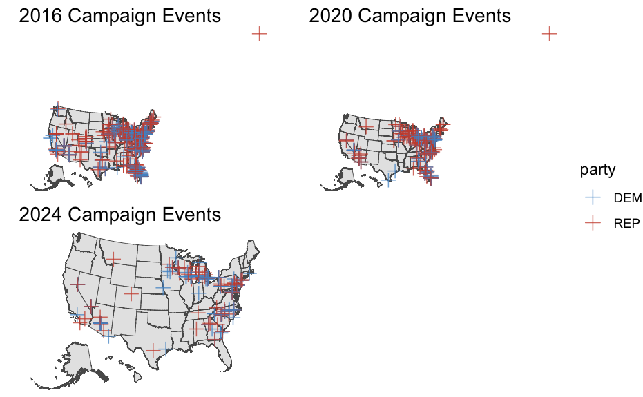

<script src="index_files/kePrint/kePrint.js"></script>
<link href="index_files/lightable/lightable.css" rel="stylesheet" />
<script src="index_files/kePrint/kePrint.js"></script>
<link href="index_files/lightable/lightable.css" rel="stylesheet" />
<script src="index_files/kePrint/kePrint.js"></script>
<link href="index_files/lightable/lightable.css" rel="stylesheet" />

# **Week 7: Ground Game**

**Monday, October 21, 2024**\
**14 Days until Presidential Election**

*Two more weeks until election day! Right now, both candidates are engaging in last-ditch efforts to attract undecided voters. Trump and Harris are jumping between battleground states (and other key electorates) holding media appearances, rallies, fund-raisers, and other campaign events. [The New York Times](https://www.nytimes.com/interactive/2024/10/16/us/politics/harris-trump-2024-campaign.html) reports that Harris has campaigned at 39 events since September 1st while Trump has campaigned at 59. Whether this discrepancy will have an effect on vote share will be the focus of this week's post.*


## Binomial Logit Simulations and Probabilistic Models


```
## Joining with `by = join_by(year, state)`
```

}}index_files/figure-html/unnamed-chunk-3-1.png" width="672" />}}index_files/figure-html/unnamed-chunk-3-2.png" width="672" />}}index_files/figure-html/unnamed-chunk-3-3.png" width="672" />

```
## [1] 7803102
```

```
## [1] 42.59986
```

```
## [1] 46.66471
```

```
## [1] 3.710212
```

```
## [1] 6.070667
```

```
## [1] 0.2486347
```

```
## [1] 0.272381
```

}}index_files/figure-html/unnamed-chunk-3-4.png" width="672" />}}index_files/figure-html/unnamed-chunk-3-5.png" width="672" />}}index_files/figure-html/unnamed-chunk-3-6.png" width="672" />}}index_files/figure-html/unnamed-chunk-3-7.png" width="672" />}}index_files/figure-html/unnamed-chunk-3-8.png" width="672" />

Up until this point, I have generally been using linear regression models to predict party vote shares and turnout. As we have seen through the weeks, there are a couple problems that consistently appear. Total vote shares can add up to over 100%, but binomial logit regressions ensure that outcomes stick within a certain 0-1 threshold. What's more, binomial logit regressions are strong in showing the odds of one outcome over another, which is most helpful in determining who is most likely to win an election.

The above charts demonstrate the relationship between hypothetical poll support for each party in each state with the probability of state-eligible voter voting for party. We can compare North Carolina and Georgia and see that there exist two different non-linear relationships across the states. In Georgia, as poll support for both Democrats and Republicans increase, the probability of state-eligible voter voting for the respective party increases relatively gradually. In North Carolina, as poll support for Democrats increase, the probability of state-eligible voter voting for Democrats increases dramatically (the relationship for Republicans appears more gradual and linear).

In Georgia, my home state, the voting eligible population increases linearly with each year.

The distribution of predicted draws on the win margin for Trump in Georgia shows a firm lead with a range of around 4 points in his favor.

We have simulated fluctuations in the probability of a voter from the voting eligible population voting for a party by using a prior at the standard deviation of its polls. This distribution demonstrates an incredibly close race between Harris and Trump but a skew toward Trump, suggesting a Trump victory.

## Field Offices and Campaign Events

<table class="table" style="width: auto !important; margin-left: auto; margin-right: auto;">
<caption>Table 1: Obama Romney Field Offices</caption>
 <thead>
  <tr>
   <th style="text-align:left;">   </th>
   <th style="text-align:center;"> Model 1 </th>
   <th style="text-align:center;"> Model 2 </th>
  </tr>
 </thead>
<tbody>
  <tr>
   <td style="text-align:left;"> (Intercept) </td>
   <td style="text-align:center;"> −0.340 </td>
   <td style="text-align:center;"> 0.001 </td>
  </tr>
  <tr>
   <td style="text-align:left;">  </td>
   <td style="text-align:center;"> (0.196) </td>
   <td style="text-align:center;"> (0.079) </td>
  </tr>
  <tr>
   <td style="text-align:left;"> romney12fo </td>
   <td style="text-align:center;"> 2.546 </td>
   <td style="text-align:center;">  </td>
  </tr>
  <tr>
   <td style="text-align:left;">  </td>
   <td style="text-align:center;"> (0.114) </td>
   <td style="text-align:center;">  </td>
  </tr>
  <tr>
   <td style="text-align:left;"> swingTRUE </td>
   <td style="text-align:center;"> 0.0006 </td>
   <td style="text-align:center;"> −0.012 </td>
  </tr>
  <tr>
   <td style="text-align:left;">  </td>
   <td style="text-align:center;"> (0.055) </td>
   <td style="text-align:center;"> (0.011) </td>
  </tr>
  <tr>
   <td style="text-align:left;"> core_repTRUE </td>
   <td style="text-align:center;"> 0.007 </td>
   <td style="text-align:center;">  </td>
  </tr>
  <tr>
   <td style="text-align:left;">  </td>
   <td style="text-align:center;"> (0.061) </td>
   <td style="text-align:center;">  </td>
  </tr>
  <tr>
   <td style="text-align:left;"> battleTRUE </td>
   <td style="text-align:center;"> 0.541 </td>
   <td style="text-align:center;"> 0.014 </td>
  </tr>
  <tr>
   <td style="text-align:left;">  </td>
   <td style="text-align:center;"> (0.096) </td>
   <td style="text-align:center;"> (0.042) </td>
  </tr>
  <tr>
   <td style="text-align:left;"> medage08 </td>
   <td style="text-align:center;"> −0.0003 </td>
   <td style="text-align:center;"> −0.0009 </td>
  </tr>
  <tr>
   <td style="text-align:left;">  </td>
   <td style="text-align:center;"> (0.003) </td>
   <td style="text-align:center;"> (0.001) </td>
  </tr>
  <tr>
   <td style="text-align:left;"> pop2008 </td>
   <td style="text-align:center;"> 0.0000007 </td>
   <td style="text-align:center;"> −7e−08 </td>
  </tr>
  <tr>
   <td style="text-align:left;">  </td>
   <td style="text-align:center;"> (4e−08) </td>
   <td style="text-align:center;"> (2e−08) </td>
  </tr>
  <tr>
   <td style="text-align:left;"> medinc08 </td>
   <td style="text-align:center;"> −0.000002 </td>
   <td style="text-align:center;"> 0.000001 </td>
  </tr>
  <tr>
   <td style="text-align:left;">  </td>
   <td style="text-align:center;"> (0.000001) </td>
   <td style="text-align:center;"> (0.0000006) </td>
  </tr>
  <tr>
   <td style="text-align:left;"> black </td>
   <td style="text-align:center;"> 0.003 </td>
   <td style="text-align:center;"> 0.00005 </td>
  </tr>
  <tr>
   <td style="text-align:left;">  </td>
   <td style="text-align:center;"> (0.001) </td>
   <td style="text-align:center;"> (0.0005) </td>
  </tr>
  <tr>
   <td style="text-align:left;"> hispanic </td>
   <td style="text-align:center;"> 0.0002 </td>
   <td style="text-align:center;"> 0.0008 </td>
  </tr>
  <tr>
   <td style="text-align:left;">  </td>
   <td style="text-align:center;"> (0.001) </td>
   <td style="text-align:center;"> (0.0006) </td>
  </tr>
  <tr>
   <td style="text-align:left;"> pc_less_hs00 </td>
   <td style="text-align:center;"> 0.506 </td>
   <td style="text-align:center;"> −0.130 </td>
  </tr>
  <tr>
   <td style="text-align:left;">  </td>
   <td style="text-align:center;"> (0.259) </td>
   <td style="text-align:center;"> (0.112) </td>
  </tr>
  <tr>
   <td style="text-align:left;"> pc_degree00 </td>
   <td style="text-align:center;"> 0.951 </td>
   <td style="text-align:center;"> 0.305 </td>
  </tr>
  <tr>
   <td style="text-align:left;">  </td>
   <td style="text-align:center;"> (0.223) </td>
   <td style="text-align:center;"> (0.097) </td>
  </tr>
  <tr>
   <td style="text-align:left;"> as.factor(state)Arizona </td>
   <td style="text-align:center;"> −0.028 </td>
   <td style="text-align:center;"> −0.050 </td>
  </tr>
  <tr>
   <td style="text-align:left;">  </td>
   <td style="text-align:center;"> (0.156) </td>
   <td style="text-align:center;"> (0.067) </td>
  </tr>
  <tr>
   <td style="text-align:left;"> as.factor(state)Arkansas </td>
   <td style="text-align:center;"> 0.076 </td>
   <td style="text-align:center;"> 0.001 </td>
  </tr>
  <tr>
   <td style="text-align:left;">  </td>
   <td style="text-align:center;"> (0.090) </td>
   <td style="text-align:center;"> (0.039) </td>
  </tr>
  <tr>
   <td style="text-align:left;"> as.factor(state)California </td>
   <td style="text-align:center;"> −0.076 </td>
   <td style="text-align:center;"> −0.099 </td>
  </tr>
  <tr>
   <td style="text-align:left;">  </td>
   <td style="text-align:center;"> (0.104) </td>
   <td style="text-align:center;"> (0.045) </td>
  </tr>
  <tr>
   <td style="text-align:left;"> as.factor(state)Colorado </td>
   <td style="text-align:center;"> 0.163 </td>
   <td style="text-align:center;"> −0.173 </td>
  </tr>
  <tr>
   <td style="text-align:left;">  </td>
   <td style="text-align:center;"> (0.094) </td>
   <td style="text-align:center;"> (0.041) </td>
  </tr>
  <tr>
   <td style="text-align:left;"> as.factor(state)Connecticut </td>
   <td style="text-align:center;"> 0.036 </td>
   <td style="text-align:center;"> −0.145 </td>
  </tr>
  <tr>
   <td style="text-align:left;">  </td>
   <td style="text-align:center;"> (0.200) </td>
   <td style="text-align:center;"> (0.086) </td>
  </tr>
  <tr>
   <td style="text-align:left;"> as.factor(state)Delaware </td>
   <td style="text-align:center;"> 0.207 </td>
   <td style="text-align:center;"> −0.135 </td>
  </tr>
  <tr>
   <td style="text-align:left;">  </td>
   <td style="text-align:center;"> (0.309) </td>
   <td style="text-align:center;"> (0.134) </td>
  </tr>
  <tr>
   <td style="text-align:left;"> as.factor(state)Florida </td>
   <td style="text-align:center;"> −0.290 </td>
   <td style="text-align:center;"> 0.244 </td>
  </tr>
  <tr>
   <td style="text-align:left;">  </td>
   <td style="text-align:center;"> (0.091) </td>
   <td style="text-align:center;"> (0.039) </td>
  </tr>
  <tr>
   <td style="text-align:left;"> as.factor(state)Georgia </td>
   <td style="text-align:center;"> 0.029 </td>
   <td style="text-align:center;"> −0.018 </td>
  </tr>
  <tr>
   <td style="text-align:left;">  </td>
   <td style="text-align:center;"> (0.077) </td>
   <td style="text-align:center;"> (0.033) </td>
  </tr>
  <tr>
   <td style="text-align:left;"> as.factor(state)Hawaii </td>
   <td style="text-align:center;"> 0.179 </td>
   <td style="text-align:center;"> −0.126 </td>
  </tr>
  <tr>
   <td style="text-align:left;">  </td>
   <td style="text-align:center;"> (0.272) </td>
   <td style="text-align:center;"> (0.117) </td>
  </tr>
  <tr>
   <td style="text-align:left;"> as.factor(state)Idaho </td>
   <td style="text-align:center;"> 0.154 </td>
   <td style="text-align:center;"> −0.054 </td>
  </tr>
  <tr>
   <td style="text-align:left;">  </td>
   <td style="text-align:center;"> (0.109) </td>
   <td style="text-align:center;"> (0.047) </td>
  </tr>
  <tr>
   <td style="text-align:left;"> as.factor(state)Illinois </td>
   <td style="text-align:center;"> 0.117 </td>
   <td style="text-align:center;"> −0.033 </td>
  </tr>
  <tr>
   <td style="text-align:left;">  </td>
   <td style="text-align:center;"> (0.088) </td>
   <td style="text-align:center;"> (0.038) </td>
  </tr>
  <tr>
   <td style="text-align:left;"> as.factor(state)Indiana </td>
   <td style="text-align:center;"> 0.140 </td>
   <td style="text-align:center;"> −0.032 </td>
  </tr>
  <tr>
   <td style="text-align:left;">  </td>
   <td style="text-align:center;"> (0.090) </td>
   <td style="text-align:center;"> (0.039) </td>
  </tr>
  <tr>
   <td style="text-align:left;"> as.factor(state)Iowa </td>
   <td style="text-align:center;"> 0.081 </td>
   <td style="text-align:center;"> −0.115 </td>
  </tr>
  <tr>
   <td style="text-align:left;">  </td>
   <td style="text-align:center;"> (0.081) </td>
   <td style="text-align:center;"> (0.035) </td>
  </tr>
  <tr>
   <td style="text-align:left;"> as.factor(state)Kansas </td>
   <td style="text-align:center;"> 0.147 </td>
   <td style="text-align:center;"> −0.046 </td>
  </tr>
  <tr>
   <td style="text-align:left;">  </td>
   <td style="text-align:center;"> (0.091) </td>
   <td style="text-align:center;"> (0.039) </td>
  </tr>
  <tr>
   <td style="text-align:left;"> as.factor(state)Kentucky </td>
   <td style="text-align:center;"> 0.105 </td>
   <td style="text-align:center;"> 0.008 </td>
  </tr>
  <tr>
   <td style="text-align:left;">  </td>
   <td style="text-align:center;"> (0.084) </td>
   <td style="text-align:center;"> (0.036) </td>
  </tr>
  <tr>
   <td style="text-align:left;"> as.factor(state)Louisiana </td>
   <td style="text-align:center;"> −0.004 </td>
   <td style="text-align:center;"> −0.0009 </td>
  </tr>
  <tr>
   <td style="text-align:left;">  </td>
   <td style="text-align:center;"> (0.092) </td>
   <td style="text-align:center;"> (0.040) </td>
  </tr>
  <tr>
   <td style="text-align:left;"> as.factor(state)Maine </td>
   <td style="text-align:center;"> 0.274 </td>
   <td style="text-align:center;"> −0.088 </td>
  </tr>
  <tr>
   <td style="text-align:left;">  </td>
   <td style="text-align:center;"> (0.150) </td>
   <td style="text-align:center;"> (0.065) </td>
  </tr>
  <tr>
   <td style="text-align:left;"> as.factor(state)Maryland </td>
   <td style="text-align:center;"> −0.047 </td>
   <td style="text-align:center;"> −0.074 </td>
  </tr>
  <tr>
   <td style="text-align:left;">  </td>
   <td style="text-align:center;"> (0.128) </td>
   <td style="text-align:center;"> (0.055) </td>
  </tr>
  <tr>
   <td style="text-align:left;"> as.factor(state)Massachusetts </td>
   <td style="text-align:center;"> −0.118 </td>
   <td style="text-align:center;"> −0.110 </td>
  </tr>
  <tr>
   <td style="text-align:left;">  </td>
   <td style="text-align:center;"> (0.163) </td>
   <td style="text-align:center;"> (0.070) </td>
  </tr>
  <tr>
   <td style="text-align:left;"> as.factor(state)Michigan </td>
   <td style="text-align:center;"> −0.083 </td>
   <td style="text-align:center;"> 0.175 </td>
  </tr>
  <tr>
   <td style="text-align:left;">  </td>
   <td style="text-align:center;"> (0.093) </td>
   <td style="text-align:center;"> (0.040) </td>
  </tr>
  <tr>
   <td style="text-align:left;"> as.factor(state)Minnesota </td>
   <td style="text-align:center;"> 0.271 </td>
   <td style="text-align:center;"> −0.073 </td>
  </tr>
  <tr>
   <td style="text-align:left;">  </td>
   <td style="text-align:center;"> (0.092) </td>
   <td style="text-align:center;"> (0.040) </td>
  </tr>
  <tr>
   <td style="text-align:left;"> as.factor(state)Mississippi </td>
   <td style="text-align:center;"> −0.034 </td>
   <td style="text-align:center;"> 0.0002 </td>
  </tr>
  <tr>
   <td style="text-align:left;">  </td>
   <td style="text-align:center;"> (0.087) </td>
   <td style="text-align:center;"> (0.038) </td>
  </tr>
  <tr>
   <td style="text-align:left;"> as.factor(state)Missouri </td>
   <td style="text-align:center;"> 0.040 </td>
   <td style="text-align:center;"> 0.059 </td>
  </tr>
  <tr>
   <td style="text-align:left;">  </td>
   <td style="text-align:center;"> (0.085) </td>
   <td style="text-align:center;"> (0.037) </td>
  </tr>
  <tr>
   <td style="text-align:left;"> as.factor(state)Montana </td>
   <td style="text-align:center;"> 0.167 </td>
   <td style="text-align:center;"> −0.050 </td>
  </tr>
  <tr>
   <td style="text-align:left;">  </td>
   <td style="text-align:center;"> (0.103) </td>
   <td style="text-align:center;"> (0.045) </td>
  </tr>
  <tr>
   <td style="text-align:left;"> as.factor(state)Nebraska </td>
   <td style="text-align:center;"> 0.167 </td>
   <td style="text-align:center;"> −0.031 </td>
  </tr>
  <tr>
   <td style="text-align:left;">  </td>
   <td style="text-align:center;"> (0.095) </td>
   <td style="text-align:center;"> (0.041) </td>
  </tr>
  <tr>
   <td style="text-align:left;"> as.factor(state)Nevada </td>
   <td style="text-align:center;"> −0.054 </td>
   <td style="text-align:center;"> 0.208 </td>
  </tr>
  <tr>
   <td style="text-align:left;">  </td>
   <td style="text-align:center;"> (0.143) </td>
   <td style="text-align:center;"> (0.062) </td>
  </tr>
  <tr>
   <td style="text-align:left;"> as.factor(state)New Hampshire </td>
   <td style="text-align:center;"> 0.091 </td>
   <td style="text-align:center;"> 0.178 </td>
  </tr>
  <tr>
   <td style="text-align:left;">  </td>
   <td style="text-align:center;"> (0.178) </td>
   <td style="text-align:center;"> (0.077) </td>
  </tr>
  <tr>
   <td style="text-align:left;"> as.factor(state)New Jersey </td>
   <td style="text-align:center;"> −0.166 </td>
   <td style="text-align:center;"> −0.087 </td>
  </tr>
  <tr>
   <td style="text-align:left;">  </td>
   <td style="text-align:center;"> (0.137) </td>
   <td style="text-align:center;"> (0.059) </td>
  </tr>
  <tr>
   <td style="text-align:left;"> as.factor(state)New Mexico </td>
   <td style="text-align:center;"> 0.093 </td>
   <td style="text-align:center;"> 0.080 </td>
  </tr>
  <tr>
   <td style="text-align:left;">  </td>
   <td style="text-align:center;"> (0.128) </td>
   <td style="text-align:center;"> (0.055) </td>
  </tr>
  <tr>
   <td style="text-align:left;"> as.factor(state)New York </td>
   <td style="text-align:center;"> −0.019 </td>
   <td style="text-align:center;"> −0.056 </td>
  </tr>
  <tr>
   <td style="text-align:left;">  </td>
   <td style="text-align:center;"> (0.097) </td>
   <td style="text-align:center;"> (0.042) </td>
  </tr>
  <tr>
   <td style="text-align:left;"> as.factor(state)North Carolina </td>
   <td style="text-align:center;"> 0.230 </td>
   <td style="text-align:center;"> 0.054 </td>
  </tr>
  <tr>
   <td style="text-align:left;">  </td>
   <td style="text-align:center;"> (0.084) </td>
   <td style="text-align:center;"> (0.036) </td>
  </tr>
  <tr>
   <td style="text-align:left;"> as.factor(state)North Dakota </td>
   <td style="text-align:center;"> 0.163 </td>
   <td style="text-align:center;"> −0.032 </td>
  </tr>
  <tr>
   <td style="text-align:left;">  </td>
   <td style="text-align:center;"> (0.102) </td>
   <td style="text-align:center;"> (0.044) </td>
  </tr>
  <tr>
   <td style="text-align:left;"> as.factor(state)Ohio </td>
   <td style="text-align:center;"> 0.305 </td>
   <td style="text-align:center;"> −0.031 </td>
  </tr>
  <tr>
   <td style="text-align:left;">  </td>
   <td style="text-align:center;"> (0.084) </td>
   <td style="text-align:center;"> (0.036) </td>
  </tr>
  <tr>
   <td style="text-align:left;"> as.factor(state)Oklahoma </td>
   <td style="text-align:center;"> 0.113 </td>
   <td style="text-align:center;"> −0.022 </td>
  </tr>
  <tr>
   <td style="text-align:left;">  </td>
   <td style="text-align:center;"> (0.092) </td>
   <td style="text-align:center;"> (0.040) </td>
  </tr>
  <tr>
   <td style="text-align:left;"> as.factor(state)Oregon </td>
   <td style="text-align:center;"> 0.270 </td>
   <td style="text-align:center;"> −0.093 </td>
  </tr>
  <tr>
   <td style="text-align:left;">  </td>
   <td style="text-align:center;"> (0.115) </td>
   <td style="text-align:center;"> (0.050) </td>
  </tr>
  <tr>
   <td style="text-align:left;"> as.factor(state)Pennsylvania </td>
   <td style="text-align:center;"> −0.351 </td>
   <td style="text-align:center;"> 0.111 </td>
  </tr>
  <tr>
   <td style="text-align:left;">  </td>
   <td style="text-align:center;"> (0.089) </td>
   <td style="text-align:center;"> (0.039) </td>
  </tr>
  <tr>
   <td style="text-align:left;"> as.factor(state)Rhode Island </td>
   <td style="text-align:center;"> 0.117 </td>
   <td style="text-align:center;"> −0.123 </td>
  </tr>
  <tr>
   <td style="text-align:left;">  </td>
   <td style="text-align:center;"> (0.246) </td>
   <td style="text-align:center;"> (0.106) </td>
  </tr>
  <tr>
   <td style="text-align:left;"> as.factor(state)South Carolina </td>
   <td style="text-align:center;"> −0.003 </td>
   <td style="text-align:center;"> −0.027 </td>
  </tr>
  <tr>
   <td style="text-align:left;">  </td>
   <td style="text-align:center;"> (0.101) </td>
   <td style="text-align:center;"> (0.044) </td>
  </tr>
  <tr>
   <td style="text-align:left;"> as.factor(state)South Dakota </td>
   <td style="text-align:center;"> 0.156 </td>
   <td style="text-align:center;"> −0.033 </td>
  </tr>
  <tr>
   <td style="text-align:left;">  </td>
   <td style="text-align:center;"> (0.097) </td>
   <td style="text-align:center;"> (0.042) </td>
  </tr>
  <tr>
   <td style="text-align:left;"> as.factor(state)Tennessee </td>
   <td style="text-align:center;"> 0.081 </td>
   <td style="text-align:center;"> 0.005 </td>
  </tr>
  <tr>
   <td style="text-align:left;">  </td>
   <td style="text-align:center;"> (0.087) </td>
   <td style="text-align:center;"> (0.038) </td>
  </tr>
  <tr>
   <td style="text-align:left;"> as.factor(state)Texas </td>
   <td style="text-align:center;"> 0.044 </td>
   <td style="text-align:center;"> −0.037 </td>
  </tr>
  <tr>
   <td style="text-align:left;">  </td>
   <td style="text-align:center;"> (0.082) </td>
   <td style="text-align:center;"> (0.035) </td>
  </tr>
  <tr>
   <td style="text-align:left;"> as.factor(state)Utah </td>
   <td style="text-align:center;"> 0.036 </td>
   <td style="text-align:center;"> 0.060 </td>
  </tr>
  <tr>
   <td style="text-align:left;">  </td>
   <td style="text-align:center;"> (0.124) </td>
   <td style="text-align:center;"> (0.054) </td>
  </tr>
  <tr>
   <td style="text-align:left;"> as.factor(state)Vermont </td>
   <td style="text-align:center;"> 0.146 </td>
   <td style="text-align:center;"> −0.080 </td>
  </tr>
  <tr>
   <td style="text-align:left;">  </td>
   <td style="text-align:center;"> (0.158) </td>
   <td style="text-align:center;"> (0.068) </td>
  </tr>
  <tr>
   <td style="text-align:left;"> as.factor(state)Virginia </td>
   <td style="text-align:center;"> −0.396 </td>
   <td style="text-align:center;"> 0.027 </td>
  </tr>
  <tr>
   <td style="text-align:left;">  </td>
   <td style="text-align:center;"> (0.083) </td>
   <td style="text-align:center;"> (0.036) </td>
  </tr>
  <tr>
   <td style="text-align:left;"> as.factor(state)Washington </td>
   <td style="text-align:center;"> 0.280 </td>
   <td style="text-align:center;"> −0.122 </td>
  </tr>
  <tr>
   <td style="text-align:left;">  </td>
   <td style="text-align:center;"> (0.112) </td>
   <td style="text-align:center;"> (0.048) </td>
  </tr>
  <tr>
   <td style="text-align:left;"> as.factor(state)West Virginia </td>
   <td style="text-align:center;"> 0.142 </td>
   <td style="text-align:center;"> 0.003 </td>
  </tr>
  <tr>
   <td style="text-align:left;">  </td>
   <td style="text-align:center;"> (0.099) </td>
   <td style="text-align:center;"> (0.043) </td>
  </tr>
  <tr>
   <td style="text-align:left;"> as.factor(state)Wyoming </td>
   <td style="text-align:center;"> 0.160 </td>
   <td style="text-align:center;"> −0.064 </td>
  </tr>
  <tr>
   <td style="text-align:left;">  </td>
   <td style="text-align:center;"> (0.135) </td>
   <td style="text-align:center;"> (0.058) </td>
  </tr>
  <tr>
   <td style="text-align:left;"> romney12fo × swingTRUE </td>
   <td style="text-align:center;"> −0.765 </td>
   <td style="text-align:center;">  </td>
  </tr>
  <tr>
   <td style="text-align:left;">  </td>
   <td style="text-align:center;"> (0.116) </td>
   <td style="text-align:center;">  </td>
  </tr>
  <tr>
   <td style="text-align:left;"> romney12fo × core_repTRUE </td>
   <td style="text-align:center;"> −1.875 </td>
   <td style="text-align:center;">  </td>
  </tr>
  <tr>
   <td style="text-align:left;">  </td>
   <td style="text-align:center;"> (0.131) </td>
   <td style="text-align:center;">  </td>
  </tr>
  <tr>
   <td style="text-align:left;"> obama12fo </td>
   <td style="text-align:center;">  </td>
   <td style="text-align:center;"> 0.374 </td>
  </tr>
  <tr>
   <td style="text-align:left;">  </td>
   <td style="text-align:center;">  </td>
   <td style="text-align:center;"> (0.020) </td>
  </tr>
  <tr>
   <td style="text-align:left;"> core_demTRUE </td>
   <td style="text-align:center;">  </td>
   <td style="text-align:center;"> 0.004 </td>
  </tr>
  <tr>
   <td style="text-align:left;">  </td>
   <td style="text-align:center;">  </td>
   <td style="text-align:center;"> (0.027) </td>
  </tr>
  <tr>
   <td style="text-align:left;"> obama12fo × swingTRUE </td>
   <td style="text-align:center;">  </td>
   <td style="text-align:center;"> −0.081 </td>
  </tr>
  <tr>
   <td style="text-align:left;">  </td>
   <td style="text-align:center;">  </td>
   <td style="text-align:center;"> (0.020) </td>
  </tr>
  <tr>
   <td style="text-align:left;"> obama12fo × core_demTRUE </td>
   <td style="text-align:center;">  </td>
   <td style="text-align:center;"> −0.164 </td>
  </tr>
  <tr>
   <td style="text-align:left;box-shadow: 0px 1px">  </td>
   <td style="text-align:center;box-shadow: 0px 1px">  </td>
   <td style="text-align:center;box-shadow: 0px 1px"> (0.023) </td>
  </tr>
  <tr>
   <td style="text-align:left;"> Num.Obs. </td>
   <td style="text-align:center;"> 3110 </td>
   <td style="text-align:center;"> 3110 </td>
  </tr>
  <tr>
   <td style="text-align:left;"> R2 </td>
   <td style="text-align:center;"> 0.712 </td>
   <td style="text-align:center;"> 0.651 </td>
  </tr>
  <tr>
   <td style="text-align:left;"> R2 Adj. </td>
   <td style="text-align:center;"> 0.706 </td>
   <td style="text-align:center;"> 0.644 </td>
  </tr>
  <tr>
   <td style="text-align:left;"> AIC </td>
   <td style="text-align:center;"> 4851.7 </td>
   <td style="text-align:center;"> −366.8 </td>
  </tr>
  <tr>
   <td style="text-align:left;"> BIC </td>
   <td style="text-align:center;"> 5226.3 </td>
   <td style="text-align:center;"> 7.9 </td>
  </tr>
  <tr>
   <td style="text-align:left;"> Log.Lik. </td>
   <td style="text-align:center;"> −2363.855 </td>
   <td style="text-align:center;"> 245.384 </td>
  </tr>
  <tr>
   <td style="text-align:left;"> RMSE </td>
   <td style="text-align:center;"> 0.52 </td>
   <td style="text-align:center;"> 0.22 </td>
  </tr>
</tbody>
</table>

<table class="table" style="width: auto !important; margin-left: auto; margin-right: auto;">
<caption>Table 1: Effects of Field Offices on Turnout and Vote Share</caption>
 <thead>
  <tr>
   <th style="text-align:left;">   </th>
   <th style="text-align:center;"> Model 1 </th>
   <th style="text-align:center;"> Model 2 </th>
  </tr>
 </thead>
<tbody>
  <tr>
   <td style="text-align:left;"> (Intercept) </td>
   <td style="text-align:center;"> 0.029 </td>
   <td style="text-align:center;"> 0.022 </td>
  </tr>
  <tr>
   <td style="text-align:left;">  </td>
   <td style="text-align:center;"> (0.002) </td>
   <td style="text-align:center;"> (0.003) </td>
  </tr>
  <tr>
   <td style="text-align:left;"> dummy_fo_change </td>
   <td style="text-align:center;"> 0.004 </td>
   <td style="text-align:center;"> 0.009 </td>
  </tr>
  <tr>
   <td style="text-align:left;">  </td>
   <td style="text-align:center;"> (0.001) </td>
   <td style="text-align:center;"> (0.002) </td>
  </tr>
  <tr>
   <td style="text-align:left;"> battleTRUE </td>
   <td style="text-align:center;"> 0.024 </td>
   <td style="text-align:center;"> 0.043 </td>
  </tr>
  <tr>
   <td style="text-align:left;">  </td>
   <td style="text-align:center;"> (0.002) </td>
   <td style="text-align:center;"> (0.003) </td>
  </tr>
  <tr>
   <td style="text-align:left;"> as.factor(state)Arizona </td>
   <td style="text-align:center;"> −0.012 </td>
   <td style="text-align:center;"> 0.0004 </td>
  </tr>
  <tr>
   <td style="text-align:left;">  </td>
   <td style="text-align:center;"> (0.005) </td>
   <td style="text-align:center;"> (0.007) </td>
  </tr>
  <tr>
   <td style="text-align:left;"> as.factor(state)Arkansas </td>
   <td style="text-align:center;"> −0.026 </td>
   <td style="text-align:center;"> −0.055 </td>
  </tr>
  <tr>
   <td style="text-align:left;">  </td>
   <td style="text-align:center;"> (0.003) </td>
   <td style="text-align:center;"> (0.004) </td>
  </tr>
  <tr>
   <td style="text-align:left;"> as.factor(state)California </td>
   <td style="text-align:center;"> −0.021 </td>
   <td style="text-align:center;"> 0.020 </td>
  </tr>
  <tr>
   <td style="text-align:left;">  </td>
   <td style="text-align:center;"> (0.003) </td>
   <td style="text-align:center;"> (0.005) </td>
  </tr>
  <tr>
   <td style="text-align:left;"> as.factor(state)Colorado </td>
   <td style="text-align:center;"> −0.024 </td>
   <td style="text-align:center;"> −0.035 </td>
  </tr>
  <tr>
   <td style="text-align:left;">  </td>
   <td style="text-align:center;"> (0.003) </td>
   <td style="text-align:center;"> (0.005) </td>
  </tr>
  <tr>
   <td style="text-align:left;"> as.factor(state)Connecticut </td>
   <td style="text-align:center;"> −0.022 </td>
   <td style="text-align:center;"> 0.008 </td>
  </tr>
  <tr>
   <td style="text-align:left;">  </td>
   <td style="text-align:center;"> (0.006) </td>
   <td style="text-align:center;"> (0.010) </td>
  </tr>
  <tr>
   <td style="text-align:left;"> as.factor(state)Delaware </td>
   <td style="text-align:center;"> −0.001 </td>
   <td style="text-align:center;"> 0.033 </td>
  </tr>
  <tr>
   <td style="text-align:left;">  </td>
   <td style="text-align:center;"> (0.010) </td>
   <td style="text-align:center;"> (0.015) </td>
  </tr>
  <tr>
   <td style="text-align:left;"> as.factor(state)District of Columbia </td>
   <td style="text-align:center;"> 0.035 </td>
   <td style="text-align:center;"> −0.002 </td>
  </tr>
  <tr>
   <td style="text-align:left;">  </td>
   <td style="text-align:center;"> (0.017) </td>
   <td style="text-align:center;"> (0.026) </td>
  </tr>
  <tr>
   <td style="text-align:left;"> as.factor(state)Florida </td>
   <td style="text-align:center;"> −0.035 </td>
   <td style="text-align:center;"> −0.048 </td>
  </tr>
  <tr>
   <td style="text-align:left;">  </td>
   <td style="text-align:center;"> (0.003) </td>
   <td style="text-align:center;"> (0.005) </td>
  </tr>
  <tr>
   <td style="text-align:left;"> as.factor(state)Georgia </td>
   <td style="text-align:center;"> −0.001 </td>
   <td style="text-align:center;"> 0.002 </td>
  </tr>
  <tr>
   <td style="text-align:left;">  </td>
   <td style="text-align:center;"> (0.002) </td>
   <td style="text-align:center;"> (0.004) </td>
  </tr>
  <tr>
   <td style="text-align:left;"> as.factor(state)Hawaii </td>
   <td style="text-align:center;"> −0.021 </td>
   <td style="text-align:center;"> 0.069 </td>
  </tr>
  <tr>
   <td style="text-align:left;">  </td>
   <td style="text-align:center;"> (0.009) </td>
   <td style="text-align:center;"> (0.013) </td>
  </tr>
  <tr>
   <td style="text-align:left;"> as.factor(state)Idaho </td>
   <td style="text-align:center;"> −0.023 </td>
   <td style="text-align:center;"> 0.005 </td>
  </tr>
  <tr>
   <td style="text-align:left;">  </td>
   <td style="text-align:center;"> (0.003) </td>
   <td style="text-align:center;"> (0.005) </td>
  </tr>
  <tr>
   <td style="text-align:left;"> as.factor(state)Illinois </td>
   <td style="text-align:center;"> −0.029 </td>
   <td style="text-align:center;"> −0.004 </td>
  </tr>
  <tr>
   <td style="text-align:left;">  </td>
   <td style="text-align:center;"> (0.003) </td>
   <td style="text-align:center;"> (0.004) </td>
  </tr>
  <tr>
   <td style="text-align:left;"> as.factor(state)Indiana </td>
   <td style="text-align:center;"> −0.030 </td>
   <td style="text-align:center;"> −0.010 </td>
  </tr>
  <tr>
   <td style="text-align:left;">  </td>
   <td style="text-align:center;"> (0.003) </td>
   <td style="text-align:center;"> (0.004) </td>
  </tr>
  <tr>
   <td style="text-align:left;"> as.factor(state)Iowa </td>
   <td style="text-align:center;"> −0.038 </td>
   <td style="text-align:center;"> −0.039 </td>
  </tr>
  <tr>
   <td style="text-align:left;">  </td>
   <td style="text-align:center;"> (0.003) </td>
   <td style="text-align:center;"> (0.005) </td>
  </tr>
  <tr>
   <td style="text-align:left;"> as.factor(state)Kansas </td>
   <td style="text-align:center;"> −0.035 </td>
   <td style="text-align:center;"> −0.009 </td>
  </tr>
  <tr>
   <td style="text-align:left;">  </td>
   <td style="text-align:center;"> (0.003) </td>
   <td style="text-align:center;"> (0.004) </td>
  </tr>
  <tr>
   <td style="text-align:left;"> as.factor(state)Kentucky </td>
   <td style="text-align:center;"> −0.029 </td>
   <td style="text-align:center;"> −0.029 </td>
  </tr>
  <tr>
   <td style="text-align:left;">  </td>
   <td style="text-align:center;"> (0.003) </td>
   <td style="text-align:center;"> (0.004) </td>
  </tr>
  <tr>
   <td style="text-align:left;"> as.factor(state)Louisiana </td>
   <td style="text-align:center;"> −0.006 </td>
   <td style="text-align:center;"> −0.014 </td>
  </tr>
  <tr>
   <td style="text-align:left;">  </td>
   <td style="text-align:center;"> (0.003) </td>
   <td style="text-align:center;"> (0.004) </td>
  </tr>
  <tr>
   <td style="text-align:left;"> as.factor(state)Maine </td>
   <td style="text-align:center;"> −0.030 </td>
   <td style="text-align:center;"> 0.007 </td>
  </tr>
  <tr>
   <td style="text-align:left;">  </td>
   <td style="text-align:center;"> (0.005) </td>
   <td style="text-align:center;"> (0.007) </td>
  </tr>
  <tr>
   <td style="text-align:left;"> as.factor(state)Maryland </td>
   <td style="text-align:center;"> 0.005 </td>
   <td style="text-align:center;"> 0.020 </td>
  </tr>
  <tr>
   <td style="text-align:left;">  </td>
   <td style="text-align:center;"> (0.004) </td>
   <td style="text-align:center;"> (0.006) </td>
  </tr>
  <tr>
   <td style="text-align:left;"> as.factor(state)Massachusetts </td>
   <td style="text-align:center;"> −0.005 </td>
   <td style="text-align:center;"> −0.007 </td>
  </tr>
  <tr>
   <td style="text-align:left;">  </td>
   <td style="text-align:center;"> (0.005) </td>
   <td style="text-align:center;"> (0.007) </td>
  </tr>
  <tr>
   <td style="text-align:left;"> as.factor(state)Michigan </td>
   <td style="text-align:center;"> −0.035 </td>
   <td style="text-align:center;"> −0.019 </td>
  </tr>
  <tr>
   <td style="text-align:left;">  </td>
   <td style="text-align:center;"> (0.003) </td>
   <td style="text-align:center;"> (0.004) </td>
  </tr>
  <tr>
   <td style="text-align:left;"> as.factor(state)Minnesota </td>
   <td style="text-align:center;"> −0.021 </td>
   <td style="text-align:center;"> 0.0008 </td>
  </tr>
  <tr>
   <td style="text-align:left;">  </td>
   <td style="text-align:center;"> (0.003) </td>
   <td style="text-align:center;"> (0.004) </td>
  </tr>
  <tr>
   <td style="text-align:left;"> as.factor(state)Mississippi </td>
   <td style="text-align:center;"> 0.002 </td>
   <td style="text-align:center;"> 0.017 </td>
  </tr>
  <tr>
   <td style="text-align:left;">  </td>
   <td style="text-align:center;"> (0.003) </td>
   <td style="text-align:center;"> (0.004) </td>
  </tr>
  <tr>
   <td style="text-align:left;"> as.factor(state)Missouri </td>
   <td style="text-align:center;"> −0.037 </td>
   <td style="text-align:center;"> −0.045 </td>
  </tr>
  <tr>
   <td style="text-align:left;">  </td>
   <td style="text-align:center;"> (0.003) </td>
   <td style="text-align:center;"> (0.004) </td>
  </tr>
  <tr>
   <td style="text-align:left;"> as.factor(state)Montana </td>
   <td style="text-align:center;"> −0.015 </td>
   <td style="text-align:center;"> −0.019 </td>
  </tr>
  <tr>
   <td style="text-align:left;">  </td>
   <td style="text-align:center;"> (0.003) </td>
   <td style="text-align:center;"> (0.005) </td>
  </tr>
  <tr>
   <td style="text-align:left;"> as.factor(state)Nebraska </td>
   <td style="text-align:center;"> −0.020 </td>
   <td style="text-align:center;"> 0.008 </td>
  </tr>
  <tr>
   <td style="text-align:left;">  </td>
   <td style="text-align:center;"> (0.003) </td>
   <td style="text-align:center;"> (0.004) </td>
  </tr>
  <tr>
   <td style="text-align:left;"> as.factor(state)Nevada </td>
   <td style="text-align:center;"> −0.039 </td>
   <td style="text-align:center;"> −0.039 </td>
  </tr>
  <tr>
   <td style="text-align:left;">  </td>
   <td style="text-align:center;"> (0.005) </td>
   <td style="text-align:center;"> (0.007) </td>
  </tr>
  <tr>
   <td style="text-align:left;"> as.factor(state)New Hampshire </td>
   <td style="text-align:center;"> −0.038 </td>
   <td style="text-align:center;"> −0.032 </td>
  </tr>
  <tr>
   <td style="text-align:left;">  </td>
   <td style="text-align:center;"> (0.006) </td>
   <td style="text-align:center;"> (0.009) </td>
  </tr>
  <tr>
   <td style="text-align:left;"> as.factor(state)New Jersey </td>
   <td style="text-align:center;"> −0.018 </td>
   <td style="text-align:center;"> 0.023 </td>
  </tr>
  <tr>
   <td style="text-align:left;">  </td>
   <td style="text-align:center;"> (0.004) </td>
   <td style="text-align:center;"> (0.006) </td>
  </tr>
  <tr>
   <td style="text-align:left;"> as.factor(state)New Mexico </td>
   <td style="text-align:center;"> −0.032 </td>
   <td style="text-align:center;"> −0.008 </td>
  </tr>
  <tr>
   <td style="text-align:left;">  </td>
   <td style="text-align:center;"> (0.004) </td>
   <td style="text-align:center;"> (0.006) </td>
  </tr>
  <tr>
   <td style="text-align:left;"> as.factor(state)New York </td>
   <td style="text-align:center;"> −0.035 </td>
   <td style="text-align:center;"> 0.019 </td>
  </tr>
  <tr>
   <td style="text-align:left;">  </td>
   <td style="text-align:center;"> (0.003) </td>
   <td style="text-align:center;"> (0.004) </td>
  </tr>
  <tr>
   <td style="text-align:left;"> as.factor(state)North Carolina </td>
   <td style="text-align:center;"> 0.004 </td>
   <td style="text-align:center;"> −0.014 </td>
  </tr>
  <tr>
   <td style="text-align:left;">  </td>
   <td style="text-align:center;"> (0.003) </td>
   <td style="text-align:center;"> (0.004) </td>
  </tr>
  <tr>
   <td style="text-align:left;"> as.factor(state)North Dakota </td>
   <td style="text-align:center;"> −0.009 </td>
   <td style="text-align:center;"> 0.002 </td>
  </tr>
  <tr>
   <td style="text-align:left;">  </td>
   <td style="text-align:center;"> (0.003) </td>
   <td style="text-align:center;"> (0.005) </td>
  </tr>
  <tr>
   <td style="text-align:left;"> as.factor(state)Ohio </td>
   <td style="text-align:center;"> −0.049 </td>
   <td style="text-align:center;"> −0.041 </td>
  </tr>
  <tr>
   <td style="text-align:left;">  </td>
   <td style="text-align:center;"> (0.003) </td>
   <td style="text-align:center;"> (0.005) </td>
  </tr>
  <tr>
   <td style="text-align:left;"> as.factor(state)Oklahoma </td>
   <td style="text-align:center;"> −0.046 </td>
   <td style="text-align:center;"> −0.026 </td>
  </tr>
  <tr>
   <td style="text-align:left;">  </td>
   <td style="text-align:center;"> (0.003) </td>
   <td style="text-align:center;"> (0.004) </td>
  </tr>
  <tr>
   <td style="text-align:left;"> as.factor(state)Oregon </td>
   <td style="text-align:center;"> −0.033 </td>
   <td style="text-align:center;"> 0.006 </td>
  </tr>
  <tr>
   <td style="text-align:left;">  </td>
   <td style="text-align:center;"> (0.003) </td>
   <td style="text-align:center;"> (0.005) </td>
  </tr>
  <tr>
   <td style="text-align:left;"> as.factor(state)Pennsylvania </td>
   <td style="text-align:center;"> −0.050 </td>
   <td style="text-align:center;"> −0.047 </td>
  </tr>
  <tr>
   <td style="text-align:left;">  </td>
   <td style="text-align:center;"> (0.003) </td>
   <td style="text-align:center;"> (0.005) </td>
  </tr>
  <tr>
   <td style="text-align:left;"> as.factor(state)Rhode Island </td>
   <td style="text-align:center;"> −0.009 </td>
   <td style="text-align:center;"> 0.007 </td>
  </tr>
  <tr>
   <td style="text-align:left;">  </td>
   <td style="text-align:center;"> (0.008) </td>
   <td style="text-align:center;"> (0.012) </td>
  </tr>
  <tr>
   <td style="text-align:left;"> as.factor(state)South Carolina </td>
   <td style="text-align:center;"> 0.014 </td>
   <td style="text-align:center;"> 0.013 </td>
  </tr>
  <tr>
   <td style="text-align:left;">  </td>
   <td style="text-align:center;"> (0.003) </td>
   <td style="text-align:center;"> (0.005) </td>
  </tr>
  <tr>
   <td style="text-align:left;"> as.factor(state)South Dakota </td>
   <td style="text-align:center;"> −0.044 </td>
   <td style="text-align:center;"> −0.002 </td>
  </tr>
  <tr>
   <td style="text-align:left;">  </td>
   <td style="text-align:center;"> (0.003) </td>
   <td style="text-align:center;"> (0.004) </td>
  </tr>
  <tr>
   <td style="text-align:left;"> as.factor(state)Tennessee </td>
   <td style="text-align:center;"> −0.033 </td>
   <td style="text-align:center;"> −0.048 </td>
  </tr>
  <tr>
   <td style="text-align:left;">  </td>
   <td style="text-align:center;"> (0.003) </td>
   <td style="text-align:center;"> (0.004) </td>
  </tr>
  <tr>
   <td style="text-align:left;"> as.factor(state)Texas </td>
   <td style="text-align:center;"> −0.025 </td>
   <td style="text-align:center;"> −0.009 </td>
  </tr>
  <tr>
   <td style="text-align:left;">  </td>
   <td style="text-align:center;"> (0.002) </td>
   <td style="text-align:center;"> (0.003) </td>
  </tr>
  <tr>
   <td style="text-align:left;"> as.factor(state)Utah </td>
   <td style="text-align:center;"> −0.018 </td>
   <td style="text-align:center;"> −0.015 </td>
  </tr>
  <tr>
   <td style="text-align:left;">  </td>
   <td style="text-align:center;"> (0.004) </td>
   <td style="text-align:center;"> (0.006) </td>
  </tr>
  <tr>
   <td style="text-align:left;"> as.factor(state)Vermont </td>
   <td style="text-align:center;"> −0.025 </td>
   <td style="text-align:center;"> 0.035 </td>
  </tr>
  <tr>
   <td style="text-align:left;">  </td>
   <td style="text-align:center;"> (0.005) </td>
   <td style="text-align:center;"> (0.007) </td>
  </tr>
  <tr>
   <td style="text-align:left;"> as.factor(state)Virginia </td>
   <td style="text-align:center;"> −0.014 </td>
   <td style="text-align:center;"> −0.033 </td>
  </tr>
  <tr>
   <td style="text-align:left;">  </td>
   <td style="text-align:center;"> (0.003) </td>
   <td style="text-align:center;"> (0.005) </td>
  </tr>
  <tr>
   <td style="text-align:left;"> as.factor(state)Washington </td>
   <td style="text-align:center;"> −0.009 </td>
   <td style="text-align:center;"> 0.009 </td>
  </tr>
  <tr>
   <td style="text-align:left;">  </td>
   <td style="text-align:center;"> (0.003) </td>
   <td style="text-align:center;"> (0.005) </td>
  </tr>
  <tr>
   <td style="text-align:left;"> as.factor(state)West Virginia </td>
   <td style="text-align:center;"> −0.043 </td>
   <td style="text-align:center;"> −0.044 </td>
  </tr>
  <tr>
   <td style="text-align:left;">  </td>
   <td style="text-align:center;"> (0.003) </td>
   <td style="text-align:center;"> (0.005) </td>
  </tr>
  <tr>
   <td style="text-align:left;"> as.factor(state)Wisconsin </td>
   <td style="text-align:center;"> −0.046 </td>
   <td style="text-align:center;"> −0.037 </td>
  </tr>
  <tr>
   <td style="text-align:left;">  </td>
   <td style="text-align:center;"> (0.003) </td>
   <td style="text-align:center;"> (0.005) </td>
  </tr>
  <tr>
   <td style="text-align:left;"> as.factor(state)Wyoming </td>
   <td style="text-align:center;"> −0.021 </td>
   <td style="text-align:center;"> −0.011 </td>
  </tr>
  <tr>
   <td style="text-align:left;">  </td>
   <td style="text-align:center;"> (0.004) </td>
   <td style="text-align:center;"> (0.006) </td>
  </tr>
  <tr>
   <td style="text-align:left;"> as.factor(year)2012 </td>
   <td style="text-align:center;"> −0.021 </td>
   <td style="text-align:center;"> −0.045 </td>
  </tr>
  <tr>
   <td style="text-align:left;">  </td>
   <td style="text-align:center;"> (0.0007) </td>
   <td style="text-align:center;"> (0.001) </td>
  </tr>
  <tr>
   <td style="text-align:left;"> dummy_fo_change × battleTRUE </td>
   <td style="text-align:center;"> −0.002 </td>
   <td style="text-align:center;"> 0.007 </td>
  </tr>
  <tr>
   <td style="text-align:left;box-shadow: 0px 1px">  </td>
   <td style="text-align:center;box-shadow: 0px 1px"> (0.002) </td>
   <td style="text-align:center;box-shadow: 0px 1px"> (0.003) </td>
  </tr>
  <tr>
   <td style="text-align:left;"> Num.Obs. </td>
   <td style="text-align:center;"> 6224 </td>
   <td style="text-align:center;"> 6224 </td>
  </tr>
  <tr>
   <td style="text-align:left;"> R2 </td>
   <td style="text-align:center;"> 0.424 </td>
   <td style="text-align:center;"> 0.473 </td>
  </tr>
  <tr>
   <td style="text-align:left;"> R2 Adj. </td>
   <td style="text-align:center;"> 0.419 </td>
   <td style="text-align:center;"> 0.469 </td>
  </tr>
  <tr>
   <td style="text-align:left;"> AIC </td>
   <td style="text-align:center;"> −28783.2 </td>
   <td style="text-align:center;"> −23658.9 </td>
  </tr>
  <tr>
   <td style="text-align:left;"> BIC </td>
   <td style="text-align:center;"> −28412.7 </td>
   <td style="text-align:center;"> −23288.4 </td>
  </tr>
  <tr>
   <td style="text-align:left;"> Log.Lik. </td>
   <td style="text-align:center;"> 14446.586 </td>
   <td style="text-align:center;"> 11884.440 </td>
  </tr>
  <tr>
   <td style="text-align:left;"> RMSE </td>
   <td style="text-align:center;"> 0.02 </td>
   <td style="text-align:center;"> 0.04 </td>
  </tr>
</tbody>
</table>


| Trump Field Offices| Clinton Field Offices| Romney Field Offices| Obama Field Offices|
|-------------------:|---------------------:|--------------------:|-------------------:|
|                 165|                   538|                  283|                 791|

}}index_files/figure-html/unnamed-chunk-4-1.png" width="672" />

For now, we return to linear regressions to the evaluate the relationship between states and demographics and the presence of field offices for the Obama (Model 1) and Romney (Model 2) campaigns in 2012. The Obama model shows that, on average, for every field office that Romney had, Obama had about 2.5. The Obama and Romney campaigns also were more likely to have field offices in counties with higher educational degree attainment. The Obama campaign was more likely to have field offices in counties with higher percentages of less-than-high-school levels of educational attainment than the Romney campaign. We could analyze the relationships between these campaigns and the demographics of the counties they exist in endlessly, but these models are useful in giving color to the idea that the decision of setting up a field office in a certain district is intentional.

In another set of models, we can evaluate the effects of the presence of field offices on turnout (Model 1) and Democratic vote share (Model 2). On average, Democratic vote share and turnout were marginalyl higher in the counties of battleground states with field offices. We can also see the discrepancy in the sheer number of field offices between 2012 and 2016 campaigns; the Democratic candidates, Clinton and Obama, had far more field offices than their Republican opponents


```
## `summarise()` has grouped output by 'year', 'state'. You can override using the
## `.groups` argument.
```

<table class="table" style="width: auto !important; margin-left: auto; margin-right: auto;">
<caption>Table 2: Can the number of campaign events predict state-level vote share?</caption>
 <thead>
  <tr>
   <th style="text-align:left;">   </th>
   <th style="text-align:center;"> Model 1 </th>
   <th style="text-align:center;"> Model 2 </th>
  </tr>
 </thead>
<tbody>
  <tr>
   <td style="text-align:left;"> (Intercept) </td>
   <td style="text-align:center;"> 48.189 </td>
   <td style="text-align:center;"> 51.810 </td>
  </tr>
  <tr>
   <td style="text-align:left;">  </td>
   <td style="text-align:center;"> (0.369) </td>
   <td style="text-align:center;"> (0.369) </td>
  </tr>
  <tr>
   <td style="text-align:left;"> n_ev_D </td>
   <td style="text-align:center;"> 0.126 </td>
   <td style="text-align:center;">  </td>
  </tr>
  <tr>
   <td style="text-align:left;">  </td>
   <td style="text-align:center;"> (0.034) </td>
   <td style="text-align:center;">  </td>
  </tr>
  <tr>
   <td style="text-align:left;"> ev_diff_D_R </td>
   <td style="text-align:center;"> 0.105 </td>
   <td style="text-align:center;">  </td>
  </tr>
  <tr>
   <td style="text-align:left;">  </td>
   <td style="text-align:center;"> (0.067) </td>
   <td style="text-align:center;">  </td>
  </tr>
  <tr>
   <td style="text-align:left;"> n_ev_R </td>
   <td style="text-align:center;">  </td>
   <td style="text-align:center;"> −0.126 </td>
  </tr>
  <tr>
   <td style="text-align:left;">  </td>
   <td style="text-align:center;">  </td>
   <td style="text-align:center;"> (0.034) </td>
  </tr>
  <tr>
   <td style="text-align:left;"> ev_diff_R_D </td>
   <td style="text-align:center;">  </td>
   <td style="text-align:center;"> 0.230 </td>
  </tr>
  <tr>
   <td style="text-align:left;box-shadow: 0px 1px">  </td>
   <td style="text-align:center;box-shadow: 0px 1px">  </td>
   <td style="text-align:center;box-shadow: 0px 1px"> (0.078) </td>
  </tr>
  <tr>
   <td style="text-align:left;"> Num.Obs. </td>
   <td style="text-align:center;"> 714 </td>
   <td style="text-align:center;"> 714 </td>
  </tr>
  <tr>
   <td style="text-align:left;"> R2 </td>
   <td style="text-align:center;"> 0.021 </td>
   <td style="text-align:center;"> 0.021 </td>
  </tr>
  <tr>
   <td style="text-align:left;"> R2 Adj. </td>
   <td style="text-align:center;"> 0.019 </td>
   <td style="text-align:center;"> 0.019 </td>
  </tr>
  <tr>
   <td style="text-align:left;"> AIC </td>
   <td style="text-align:center;"> 4910.1 </td>
   <td style="text-align:center;"> 4910.2 </td>
  </tr>
  <tr>
   <td style="text-align:left;"> BIC </td>
   <td style="text-align:center;"> 4928.4 </td>
   <td style="text-align:center;"> 4928.5 </td>
  </tr>
  <tr>
   <td style="text-align:left;"> Log.Lik. </td>
   <td style="text-align:center;"> −2451.039 </td>
   <td style="text-align:center;"> −2451.089 </td>
  </tr>
  <tr>
   <td style="text-align:left;"> F </td>
   <td style="text-align:center;"> 7.778 </td>
   <td style="text-align:center;"> 7.776 </td>
  </tr>
  <tr>
   <td style="text-align:left;"> RMSE </td>
   <td style="text-align:center;"> 7.49 </td>
   <td style="text-align:center;"> 7.49 </td>
  </tr>
</tbody>
</table>



The above maps visualize the locations of various campaign events held for Democrats and Republicans across the current and past two elections. Across all three maps, we see a concentration of events in the Northeast region of the country. We also see how from 2016 to 2024, the number of events greatly diminishes in Florida; this could likely be to the fact that it is now considered much less of a swing state than it used to be. There are fewer events on the whole in 2020 because of the pandemic. By 2024, the campaign events occur either entirely in battleground states or major fundraising centers for each party (e.g. New York and California for the Democrats).

Take a look at the summary statistics of the model that we created to predict vote share based on the number of campaign events, and you will find pretty large coefficients for the Democrats when they have more events over Republicans (Model 1) and for the Repbulicans when they are the ones that possess the positive margin. This predictive power is quickly humbled by an abysmal R-Squared value. I decide to leave the number of campaign events out of my forecasting model for this reason.


```
## `summarise()` has grouped output by 'state', 'party'. You can override using
## the `.groups` argument.
```

}}index_files/figure-html/unnamed-chunk-8-1.png" width="672" />

Here, I visualize the lead that a party has over the other in terms of the number of campaign events held in key battleground states. I look at the current campaign and the past two presidential campaign years. In 2016 and 2020, the Republicans generally held more events in battleground states than the Democrats; in fact, in 2016, they held out over Democrats in all battlegrounds states. By 2024, though, Democrats are holding more events in these states. At the same time, I am still not involving campaign event lead in my predictive model, and I do not believe that Democrats having more events in these states is determinative or even indicative of a win for them.


## Updating Model Predictions


|state                | electors|winner     |
|:--------------------|--------:|:----------|
|Alabama              |        9|Republican |
|Alaska               |        3|Republican |
|Arizona              |       11|Republican |
|Arkansas             |        6|Republican |
|California           |       54|Democrat   |
|Colorado             |       10|Democrat   |
|Connecticut          |        7|Democrat   |
|Delaware             |        3|Democrat   |
|District Of Columbia |        3|Democrat   |
|Florida              |       30|Republican |
|Georgia              |       16|Republican |
|Hawaii               |        4|Democrat   |
|Idaho                |        4|Republican |
|Illinois             |       19|Democrat   |
|Indiana              |       11|Republican |
|Iowa                 |        6|Republican |
|Kansas               |        6|Republican |
|Kentucky             |        8|Republican |
|Louisiana            |        8|Republican |
|Maine                |        4|Democrat   |
|Maryland             |       10|Democrat   |
|Massachusetts        |       11|Democrat   |
|Michigan             |       15|Republican |
|Minnesota            |       10|Democrat   |
|Mississippi          |        6|Republican |
|Missouri             |       10|Republican |
|Montana              |        4|Republican |
|Nebraska             |        5|Republican |
|Nevada               |        6|Republican |
|New Hampshire        |        4|Democrat   |
|New Jersey           |       14|Democrat   |
|New Mexico           |        5|Democrat   |
|New York             |       28|Democrat   |
|North Carolina       |       16|Republican |
|North Dakota         |        3|Republican |
|Ohio                 |       17|Republican |
|Oklahoma             |        7|Republican |
|Oregon               |        8|Democrat   |
|Pennsylvania         |       19|Republican |
|Rhode Island         |        4|Democrat   |
|South Carolina       |        9|Republican |
|South Dakota         |        3|Republican |
|Tennessee            |       11|Republican |
|Texas                |       40|Republican |
|Utah                 |        6|Republican |
|Vermont              |        3|Republican |
|Virginia             |       13|Democrat   |
|Washington           |       12|Democrat   |
|West Virginia        |        4|Republican |
|Wisconsin            |       10|Republican |
|Wyoming              |        3|Republican |


|winner     | electoral_votes|
|:----------|---------------:|
|Democrat   |             223|
|Republican |             315|

}}index_files/figure-html/unnamed-chunk-12-1.png" width="672" />

This week's model is virtually the same as last week's save for the fact that I rely on elastic-net regression instead of LASSO regression. I fear that LASSO regression is too penalizing, and I think it is wise to take the best of the ridge and LASSO models for something so unclear like election forecasting. With updated polling and economic data and this new regularization method, Trump is predicted to win the election by grabbing the electoral votes of all seven of the battleground states.

## Conclusion

**According to this week's models, Trump will win the 2024 Presidential Election, taking 315 electoral votes.**

In comparison to last week's model, this week presents a landslide victory for Trump. I made an effort to regularize my model this week through a more generous method this week, and I think that is mainly why this week's model presents a much much larger margin. I will continue to regularize my models going forward. A lead in the number of campaign events a certain party holds over another does not seem to really affect vote share or relevant variables that could really tip the election in any direction. In my last week of forecasting, I hope to create one final and robust model (taking the best methods from each week) and tee up the ball for my final prediction. I look forward to seeing you next week!

## Sources

The New York Times. "Where Are Trump and Harris Campaigning?" *The New York Times*, updated 18 Oct. 2024, <https://www.nytimes.com/interactive/2024/10/16/us/politics/harris-trump-2024-campaign.html>.

Polling Data Provided by GOV 1347: Election Analytics teaching staff (which itself drew from the FiveThirtyEight GitHub)

Economic Data Provided by GOV 1347: Election Analytics teaching staff (which itself drew from the Burueau of Economic Analysia and Federal Reserve Economic Data)
