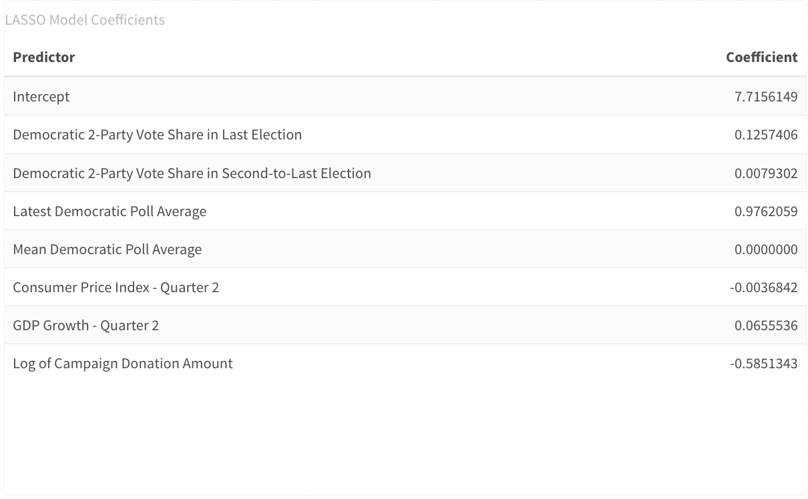
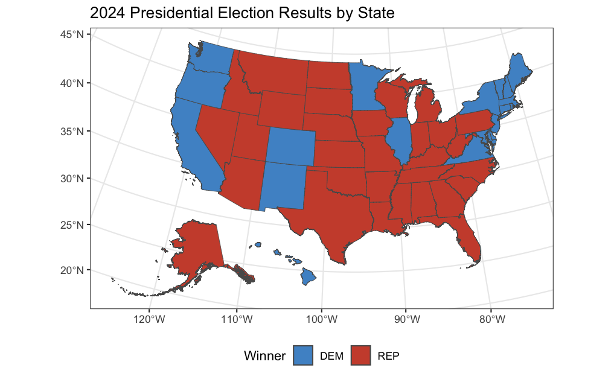
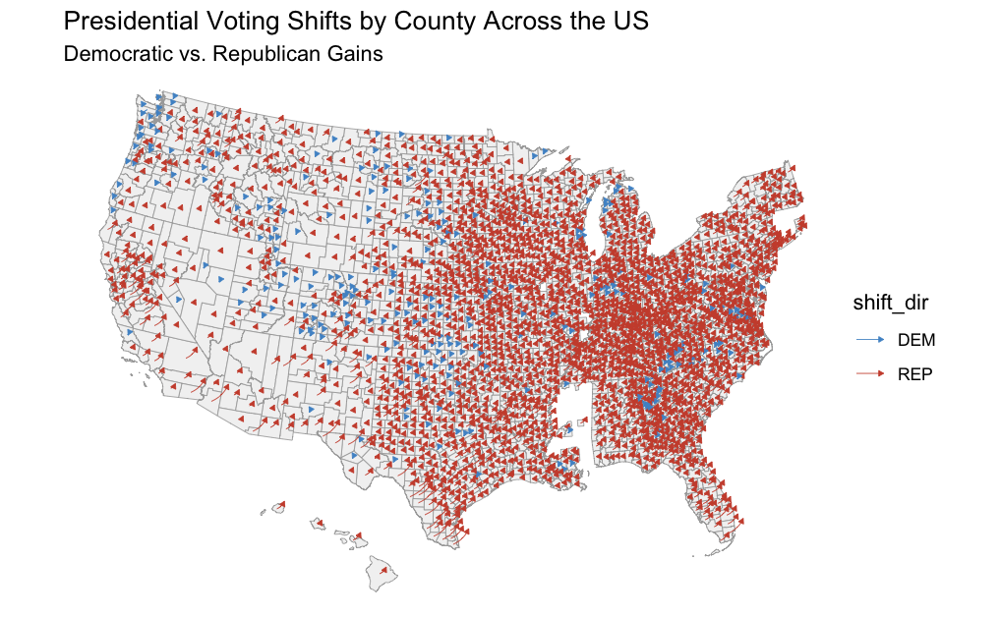
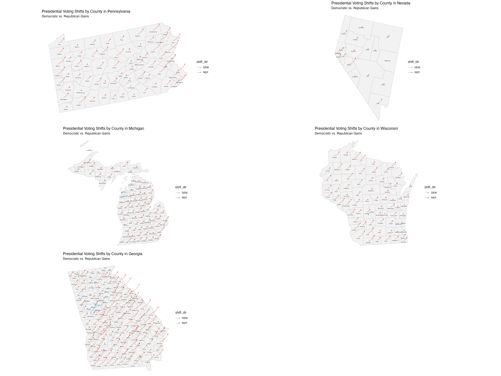

<script src="index_files/kePrint/kePrint.js"></script>
<link href="index_files/lightable/lightable.css" rel="stylesheet" />
<script src="index_files/kePrint/kePrint.js"></script>
<link href="index_files/lightable/lightable.css" rel="stylesheet" />
<script src="index_files/kePrint/kePrint.js"></script>
<link href="index_files/lightable/lightable.css" rel="stylesheet" />
<script src="index_files/kePrint/kePrint.js"></script>
<link href="index_files/lightable/lightable.css" rel="stylesheet" />
<script src="index_files/kePrint/kePrint.js"></script>
<link href="index_files/lightable/lightable.css" rel="stylesheet" />

# **Final Prediction Postmortem**

**Monday, November 17, 2024**\
**2 Weeks since Presidential Election**

*It's been two weeks since Donald Trump won the 2024 Presidential Election. If you remember my prediction, you'll notice how this is not what my model ended up forecasting. The past few days have seen Democratic strategists scrambling to figure out where they fell short. This week, I'll be doing much the same with regards to my model. We'll focus on what my model got wrong and attempt to theorize what it actually did well — despite an incorrect prediction.*

## Model Recap

As a reminder of my final model, I ultimately decided to go with a LASSO regression. I thought it was best to go with a conservative approach to building my model because so many election forecasts run into the issue of overfitting: they take in too much information that might not necessarily be significant on vote behavior and spin patterns out of the data that might not exist. LASSO was attractive to me because it wholly nullifies those predictions that are not as influential on the response variable and selects only those *most* relevant.


```
## Loading required package: Matrix
```

```
## 
## Attaching package: 'Matrix'
```

```
## The following objects are masked from 'package:tidyr':
## 
##     expand, pack, unpack
```

```
## Loaded glmnet 4.1-6
```

```
## Warning: Option grouped=FALSE enforced in cv.glmnet, since < 3 observations per
## fold
```



This is just a reminder of the coefficients of each variable involved in the LASSO regression. As you can see, the LASSO model nullifies the mean Democratic poll average, and does not consider it to be a relevant predictor for the response variable of Democratic 2-Party vote share. LASSO also notably diminishes the significance of the Consumer Price Score and GDP Growth variables as compared to previous models.

<table class="table table-striped" style="margin-left: auto; margin-right: auto;">
<caption>Table 1: (\#tab:unnamed-chunk-5)Coefficients about a 95% Confidence Interval</caption>
 <thead>
  <tr>
   <th style="text-align:left;"> Predictor </th>
   <th style="text-align:right;"> Lower </th>
   <th style="text-align:right;"> Upper </th>
  </tr>
 </thead>
<tbody>
  <tr>
   <td style="text-align:left;"> (Intercept) </td>
   <td style="text-align:right;"> -37.0735241 </td>
   <td style="text-align:right;"> 50.2256605 </td>
  </tr>
  <tr>
   <td style="text-align:left;"> D_pv2p_lag1 </td>
   <td style="text-align:right;"> 0.0000000 </td>
   <td style="text-align:right;"> 0.4574302 </td>
  </tr>
  <tr>
   <td style="text-align:left;"> D_pv2p_lag2 </td>
   <td style="text-align:right;"> -0.1224704 </td>
   <td style="text-align:right;"> 0.1576207 </td>
  </tr>
  <tr>
   <td style="text-align:left;"> latest_pollav_DEM </td>
   <td style="text-align:right;"> 0.4120334 </td>
   <td style="text-align:right;"> 1.5727115 </td>
  </tr>
  <tr>
   <td style="text-align:left;"> mean_pollav_DEM </td>
   <td style="text-align:right;"> -0.6909748 </td>
   <td style="text-align:right;"> 0.3996177 </td>
  </tr>
  <tr>
   <td style="text-align:left;"> CPI </td>
   <td style="text-align:right;"> -0.1254901 </td>
   <td style="text-align:right;"> 0.1407011 </td>
  </tr>
  <tr>
   <td style="text-align:left;"> GDP_growth_quarterly </td>
   <td style="text-align:right;"> -0.0994109 </td>
   <td style="text-align:right;"> 0.2102683 </td>
  </tr>
  <tr>
   <td style="text-align:left;"> log(contribution_receipt_amount) </td>
   <td style="text-align:right;"> -1.7544576 </td>
   <td style="text-align:right;"> 0.3380642 </td>
  </tr>
</tbody>
</table>

With bootstrapping, I got 95% confidence intervals for each variable and found most of them to include 0, which brought into question their relevance to the response variable. Nevertheless, I trusted LASSO to select those features which were most relevant to the model.

<table class="table table-striped" style="margin-left: auto; margin-right: auto;">
 <thead>
  <tr>
   <th style="text-align:left;"> State </th>
   <th style="text-align:right;"> mean_dem </th>
   <th style="text-align:right;"> sd_dem </th>
   <th style="text-align:right;"> lower_dem </th>
   <th style="text-align:right;"> upper_dem </th>
   <th style="text-align:right;"> mean_rep </th>
   <th style="text-align:right;"> sd_rep </th>
   <th style="text-align:right;"> lower_rep </th>
   <th style="text-align:right;"> upper_rep </th>
  </tr>
 </thead>
<tbody>
  <tr>
   <td style="text-align:left;"> <span style="     color: white !important;border-radius: 4px; padding-right: 4px; padding-left: 4px; background-color: rgba(205, 79, 57, 255) !important;">Arizona</span> </td>
   <td style="text-align:right;"> 49.82247 </td>
   <td style="text-align:right;"> 1.249856 </td>
   <td style="text-align:right;"> 47.37275 </td>
   <td style="text-align:right;"> 52.27219 </td>
   <td style="text-align:right;"> 50.17753 </td>
   <td style="text-align:right;"> 1.249856 </td>
   <td style="text-align:right;"> 47.72781 </td>
   <td style="text-align:right;"> 52.62725 </td>
  </tr>
  <tr>
   <td style="text-align:left;"> <span style="     color: white !important;border-radius: 4px; padding-right: 4px; padding-left: 4px; background-color: rgba(205, 79, 57, 255) !important;">Georgia</span> </td>
   <td style="text-align:right;"> 49.83683 </td>
   <td style="text-align:right;"> 1.254854 </td>
   <td style="text-align:right;"> 47.37731 </td>
   <td style="text-align:right;"> 52.29634 </td>
   <td style="text-align:right;"> 50.16317 </td>
   <td style="text-align:right;"> 1.254854 </td>
   <td style="text-align:right;"> 47.70366 </td>
   <td style="text-align:right;"> 52.62269 </td>
  </tr>
  <tr>
   <td style="text-align:left;"> <span style="     color: white !important;border-radius: 4px; padding-right: 4px; padding-left: 4px; background-color: rgba(79, 148, 205, 255) !important;">Michigan</span> </td>
   <td style="text-align:right;"> 50.62857 </td>
   <td style="text-align:right;"> 1.298490 </td>
   <td style="text-align:right;"> 48.08353 </td>
   <td style="text-align:right;"> 53.17361 </td>
   <td style="text-align:right;"> 49.37143 </td>
   <td style="text-align:right;"> 1.298490 </td>
   <td style="text-align:right;"> 46.82639 </td>
   <td style="text-align:right;"> 51.91647 </td>
  </tr>
  <tr>
   <td style="text-align:left;"> <span style="     color: white !important;border-radius: 4px; padding-right: 4px; padding-left: 4px; background-color: rgba(79, 148, 205, 255) !important;">Nevada</span> </td>
   <td style="text-align:right;"> 50.93553 </td>
   <td style="text-align:right;"> 1.256353 </td>
   <td style="text-align:right;"> 48.47308 </td>
   <td style="text-align:right;"> 53.39799 </td>
   <td style="text-align:right;"> 49.06447 </td>
   <td style="text-align:right;"> 1.256353 </td>
   <td style="text-align:right;"> 46.60201 </td>
   <td style="text-align:right;"> 51.52692 </td>
  </tr>
  <tr>
   <td style="text-align:left;"> <span style="     color: white !important;border-radius: 4px; padding-right: 4px; padding-left: 4px; background-color: rgba(205, 79, 57, 255) !important;">North Carolina</span> </td>
   <td style="text-align:right;"> 49.77338 </td>
   <td style="text-align:right;"> 1.336243 </td>
   <td style="text-align:right;"> 47.15435 </td>
   <td style="text-align:right;"> 52.39242 </td>
   <td style="text-align:right;"> 50.22662 </td>
   <td style="text-align:right;"> 1.336243 </td>
   <td style="text-align:right;"> 47.60758 </td>
   <td style="text-align:right;"> 52.84565 </td>
  </tr>
  <tr>
   <td style="text-align:left;"> <span style="     color: white !important;border-radius: 4px; padding-right: 4px; padding-left: 4px; background-color: rgba(79, 148, 205, 255) !important;">Pennsylvania</span> </td>
   <td style="text-align:right;"> 50.11565 </td>
   <td style="text-align:right;"> 1.238461 </td>
   <td style="text-align:right;"> 47.68827 </td>
   <td style="text-align:right;"> 52.54303 </td>
   <td style="text-align:right;"> 49.88435 </td>
   <td style="text-align:right;"> 1.238461 </td>
   <td style="text-align:right;"> 47.45697 </td>
   <td style="text-align:right;"> 52.31173 </td>
  </tr>
  <tr>
   <td style="text-align:left;"> <span style="     color: white !important;border-radius: 4px; padding-right: 4px; padding-left: 4px; background-color: rgba(79, 148, 205, 255) !important;">Wisconsin</span> </td>
   <td style="text-align:right;"> 51.04669 </td>
   <td style="text-align:right;"> 1.292186 </td>
   <td style="text-align:right;"> 48.51400 </td>
   <td style="text-align:right;"> 53.57938 </td>
   <td style="text-align:right;"> 48.95331 </td>
   <td style="text-align:right;"> 1.292186 </td>
   <td style="text-align:right;"> 46.42062 </td>
   <td style="text-align:right;"> 51.48600 </td>
  </tr>
</tbody>
</table>

Here, I have a chart of my vote share predictions for each battleground state and expected Michigan, Nevada, Pennsylvania, and Wisconsin to go to Harris while the rest (Arizona, Georgia, and North Carolina) would go to Trump. It is important to note, however, that for each state the win margin for each party was well within margin of error for a 95% confidence interval. This means that both Harris and Trump had a chance of winning each of the battleground states, according to my model.

## Election Recap






These two national maps show us the final election results and county-wise voting shits for presidential party. We see that all the battleground states that I predicted for went to Trump. The rest of the states performed how they did in the last presidential election. The shift map shows us an overwhelming shift toward the Republican Party even in supposed Democratic strongholds.




Take a look here at the county level shifts in presidential voting at the four battleground states that my model wrongly predicted plus my home state of Georgia. Like much of the United States, we see a sea of rightward shifts for the voters' choice for president. In Georgia, there is a pretty substantial enclave of leftward shifts in the southern Atlanta suburbs. If you look at this group within the context of the larger nationwide map we presented earlier, you'll see that these Atlanta suburbs are actually one of the few islands of leftward shifts for the entire nation.

## Model Accuracy


```
## # A tibble: 7 × 6
##   State         `Predicted Harris %` `Actual Harris %`  Error `Predicted Winner`
##   <chr>                        <dbl>             <dbl>  <dbl> <chr>             
## 1 Arizona                       49.8              47.2 -2.67  Republican        
## 2 Georgia                       49.8              48.9 -0.958 Republican        
## 3 Michigan                      50.6              49.3 -1.33  Democrat          
## 4 Nevada                        50.9              48.4 -2.56  Democrat          
## 5 North Caroli…                 49.8              48.3 -1.47  Republican        
## 6 Pennsylvania                  50.1              49.0 -1.13  Democrat          
## 7 Wisconsin                     51.0              49.5 -1.52  Democrat          
## # ℹ 1 more variable: `Actual Winner` <chr>
```

<table class="table table-striped" style="margin-left: auto; margin-right: auto;">
<caption>Table 3: (\#tab:unnamed-chunk-9)Postmortem Model Metrics</caption>
 <thead>
  <tr>
   <th style="text-align:left;"> Metric </th>
   <th style="text-align:right;"> Value </th>
  </tr>
 </thead>
<tbody>
  <tr>
   <td style="text-align:left;"> Bias </td>
   <td style="text-align:right;"> -1.662216 </td>
  </tr>
  <tr>
   <td style="text-align:left;"> Mean-Squared Error (MSE) </td>
   <td style="text-align:right;"> 3.157383 </td>
  </tr>
  <tr>
   <td style="text-align:left;"> Root Mean-Squared Error (RMSE) </td>
   <td style="text-align:right;"> 1.776903 </td>
  </tr>
  <tr>
   <td style="text-align:left;"> Mean Absolute Error (MAE) </td>
   <td style="text-align:right;"> 1.662216 </td>
  </tr>
</tbody>
</table>

Comparing the vote share predictions for each of the battleground states to the actual Democratic 2-Party vote shares, we see that the model consistently overpredicted the Democratic vote share in this election. In four of the battleground states, this had the consequence of predicting a Democratic win, when it was actually the Republican party that wont that state. In some states the error is much smaller than othes; Georgia, for example, has a much lower error than Arizona. I am curious what made the model better at predicting Democratic vote share in my home state versus Arizona or all other battleground states.

The model evaluation metric of bias corroborates this story that the model systematically overpredicted Democratic vote share. As for the other model metrics of MSE, RMSE, and MAE, we see that the actual value of error is not negligible In a race that appeared to be so close and in a game like politics, the value of a percentage point and a half matters a lot. Honestly, I do not believe my model to have been very good at predicting the outcomes this election, even if the actual vote shares were included in its 95% confidence interval.


```
## Confusion Matrix and Statistics
## 
##       Prediction
## Actual DEM REP
##    DEM   0   0
##    REP   4   3
##                                          
##                Accuracy : 0.4286         
##                  95% CI : (0.099, 0.8159)
##     No Information Rate : 0.5714         
##     P-Value [Acc > NIR] : 0.8734         
##                                          
##                   Kappa : 0              
##                                          
##  Mcnemar's Test P-Value : 0.1336         
##                                          
##             Sensitivity : 0.0000         
##             Specificity : 1.0000         
##          Pos Pred Value :    NaN         
##          Neg Pred Value : 0.4286         
##              Prevalence : 0.5714         
##          Detection Rate : 0.0000         
##    Detection Prevalence : 0.0000         
##       Balanced Accuracy : 0.5000         
##                                          
##        'Positive' Class : DEM            
## 
```

}}index_files/figure-html/unnamed-chunk-10-1.png" width="672" />

Here, I use a confusion matrix to visualize the possibilities of predictions of battleground state winners and who actually won those states. You can see, according to the summary statistics, that my model accurately predicted the winner of each battleground state about 43% of the time. I am going to be blunt and say that this is pretty bad; in fact, it is worse than just guessing randomly. There were four states that I predicted the Democrats to win when the Republicans won them. I predicted 3 states that the Republicans would win, and they won those. Because the Democrats did not win any states, I could not construct a ROC-AUC curve (Receiver Operating Characteristic, Area Under the Curve), which would help visualize the efficacy of the model at predicting a winner.

## Hypotheses For What Went Wrong

I have two main hypotheses for how my model predicted a narrow Harris victory when Trump won the electoral college in a landslide. The first is that polling data, more so than other variables overpredicted Harris's predicted vote share. The second is more technical: that LASSO regression was too strict and penalized economic indicators too heavily, which would have advantaged Trump in my model.

**Polling Variables Overshot Dem Vote Share**\
What caught my eye when I was analyzing the residuals between the actual Harris vote share and the predicted Harris vote share across the battleground states was the difference among the states. As I mentioned before, Georgia had a much lower residual than Arizona and the other battleground states. This made me question just how much polling was valued in my model. How could it be that polling quality varied that much between swing states? Perhaps Georgia polls were just better. An analysis by ABC's FiveThirtyEight, however, shows that, while Georgia polls are more accurate than a lot of the nation (especially since 2016), they are pretty similar in error to Arizona and Nevada polls. Errors of polls in Michigan and Wisconsin, though, were notably higher than Georgia's (<https://abcnews.go.com/538/states-accurate-polls/story?id=115108709>). Given the variability in poll predictability, I believe that my model could have benefited from devaluing them — remember that my LASSO regression put quite a bit of weight onto the latest polling average as a variable.

I would also like to bring attention to another reason why overreliance on polling might be flawed. In the past three elections, it seems that pollsters have struggled to account for a nebulous Trump effect — where the intentions of Trump voters were hard to pick up with polling efforts. A recent analysis by the Brooking Institution had found that the final averages undercounted Trump support, but they did not necessarily overcount Harris's (<https://www.brookings.edu/articles/the-polls-underestimated-trumps-support-again/>). Nonresponse bias that is particularly higher among Trump voters might account for this, but it has been incredibly difficult to quantify — or even prove — that this effect exists.

Lastly, when I look back on the week that I solely focused on polling data, my model had predicted a Harris victory consistently. Knowing what I know now, I would have been a little bit more cautious involving polling data into my model. You can see my blog post dedicated specifically to polling data here: <https://sduggasani.github.io/2024election-blog/post/2024-09-23-week-3-polling/>.

**LASSO Was Too Strict**\
Looking back on my model, I now believe that the LASSO method of regularization was too strict and penalized features that actually did contribute to the broader model. This issue worked in tandem with the overreliance on polling data. Because we had access to so much polling data and there was fewer data on those economic indicators which I deemed "relevant", I hypothesize that LASSO exaggerated the contribution of polling data to the model while significantly diminishing the importance of other features. Research by the Pew Research Center has found that, by far, the economy was the single most important issue facing all voters this election cycle (<https://www.pewresearch.org/politics/2024/09/09/issues-and-the-2024-election/>). My model did not reflect this, largely due to the feature selection of the LASSO regression I constructed.

**Testing These Hypotheses**\
The most obvious way to test these hypotheses is to change the regularization method from LASSO to a more liberal and forgiving method, such as elastic-net. An elastic net model would minimize multi-collinearity and increase robustness. Though LASSO and Ridge regression are also useful models, the elastic net is versatile and flexibile because it incorporates both of those methods as well. This would ensure that features other than polling are still involved and contribute to the vote share while also not overindexing on polling data. I will soon be making this change and evaluating how it performs against the actual election results.

Another test I could do is a cross-validation of polling data specifically. I would split the data into those election years where Trump was running and those election years where he was not. Then, I would use cross-validation and evaluate how polling variables influenced predictions in each subset of election years. I would be curious to see if there are higher polling residuals (also underpredicting Republican performance) in those years that Trump is a candidate versus those years when he was not. This would give some shape to the "Trump effect" and would bring into question how much weight we put on polling in forecasts with "populist" candidates like Trump.

## Updating My Model


<table class="table table-striped" style="margin-left: auto; margin-right: auto;">
 <thead>
  <tr>
   <th style="text-align:left;"> State </th>
   <th style="text-align:right;"> mean_dem </th>
   <th style="text-align:right;"> sd_dem </th>
   <th style="text-align:right;"> lower_dem </th>
   <th style="text-align:right;"> upper_dem </th>
   <th style="text-align:right;"> mean_rep </th>
   <th style="text-align:right;"> sd_rep </th>
   <th style="text-align:right;"> lower_rep </th>
   <th style="text-align:right;"> upper_rep </th>
  </tr>
 </thead>
<tbody>
  <tr>
   <td style="text-align:left;"> <span style="     color: white !important;border-radius: 4px; padding-right: 4px; padding-left: 4px; background-color: rgba(205, 79, 57, 255) !important;">Arizona</span> </td>
   <td style="text-align:right;"> 47.51200 </td>
   <td style="text-align:right;"> 1.274702 </td>
   <td style="text-align:right;"> 45.01358 </td>
   <td style="text-align:right;"> 50.01041 </td>
   <td style="text-align:right;"> 52.48800 </td>
   <td style="text-align:right;"> 1.274702 </td>
   <td style="text-align:right;"> 49.98959 </td>
   <td style="text-align:right;"> 54.98642 </td>
  </tr>
  <tr>
   <td style="text-align:left;"> <span style="     color: white !important;border-radius: 4px; padding-right: 4px; padding-left: 4px; background-color: rgba(205, 79, 57, 255) !important;">Georgia</span> </td>
   <td style="text-align:right;"> 47.57367 </td>
   <td style="text-align:right;"> 1.358221 </td>
   <td style="text-align:right;"> 44.91156 </td>
   <td style="text-align:right;"> 50.23578 </td>
   <td style="text-align:right;"> 52.42633 </td>
   <td style="text-align:right;"> 1.358221 </td>
   <td style="text-align:right;"> 49.76422 </td>
   <td style="text-align:right;"> 55.08844 </td>
  </tr>
  <tr>
   <td style="text-align:left;"> <span style="     color: white !important;border-radius: 4px; padding-right: 4px; padding-left: 4px; background-color: rgba(205, 79, 57, 255) !important;">Michigan</span> </td>
   <td style="text-align:right;"> 48.23776 </td>
   <td style="text-align:right;"> 1.258296 </td>
   <td style="text-align:right;"> 45.77150 </td>
   <td style="text-align:right;"> 50.70402 </td>
   <td style="text-align:right;"> 51.76224 </td>
   <td style="text-align:right;"> 1.258296 </td>
   <td style="text-align:right;"> 49.29598 </td>
   <td style="text-align:right;"> 54.22850 </td>
  </tr>
  <tr>
   <td style="text-align:left;"> <span style="     color: white !important;border-radius: 4px; padding-right: 4px; padding-left: 4px; background-color: rgba(205, 79, 57, 255) !important;">Nevada</span> </td>
   <td style="text-align:right;"> 48.60669 </td>
   <td style="text-align:right;"> 1.309284 </td>
   <td style="text-align:right;"> 46.04050 </td>
   <td style="text-align:right;"> 51.17289 </td>
   <td style="text-align:right;"> 51.39331 </td>
   <td style="text-align:right;"> 1.309284 </td>
   <td style="text-align:right;"> 48.82711 </td>
   <td style="text-align:right;"> 53.95950 </td>
  </tr>
  <tr>
   <td style="text-align:left;"> <span style="     color: white !important;border-radius: 4px; padding-right: 4px; padding-left: 4px; background-color: rgba(205, 79, 57, 255) !important;">North Carolina</span> </td>
   <td style="text-align:right;"> 47.41412 </td>
   <td style="text-align:right;"> 1.272296 </td>
   <td style="text-align:right;"> 44.92042 </td>
   <td style="text-align:right;"> 49.90782 </td>
   <td style="text-align:right;"> 52.58588 </td>
   <td style="text-align:right;"> 1.272296 </td>
   <td style="text-align:right;"> 50.09218 </td>
   <td style="text-align:right;"> 55.07958 </td>
  </tr>
  <tr>
   <td style="text-align:left;"> <span style="     color: white !important;border-radius: 4px; padding-right: 4px; padding-left: 4px; background-color: rgba(205, 79, 57, 255) !important;">Pennsylvania</span> </td>
   <td style="text-align:right;"> 47.77572 </td>
   <td style="text-align:right;"> 1.271046 </td>
   <td style="text-align:right;"> 45.28447 </td>
   <td style="text-align:right;"> 50.26697 </td>
   <td style="text-align:right;"> 52.22428 </td>
   <td style="text-align:right;"> 1.271046 </td>
   <td style="text-align:right;"> 49.73303 </td>
   <td style="text-align:right;"> 54.71553 </td>
  </tr>
  <tr>
   <td style="text-align:left;"> <span style="     color: white !important;border-radius: 4px; padding-right: 4px; padding-left: 4px; background-color: rgba(205, 79, 57, 255) !important;">Wisconsin</span> </td>
   <td style="text-align:right;"> 48.67043 </td>
   <td style="text-align:right;"> 1.316305 </td>
   <td style="text-align:right;"> 46.09048 </td>
   <td style="text-align:right;"> 51.25039 </td>
   <td style="text-align:right;"> 51.32957 </td>
   <td style="text-align:right;"> 1.316305 </td>
   <td style="text-align:right;"> 48.74961 </td>
   <td style="text-align:right;"> 53.90952 </td>
  </tr>
</tbody>
</table>

Here, we see that, using elastic-net regularization, we can get a Trump victory in all battleground states, just like in the election.

Let's now see how the model fares with similar bias and error metrics as we reflected upon my original model with.


```
## New names:
## • `0` -> `0...31`
## • `0` -> `0...32`
## • `0` -> `0...33`
## • `0` -> `0...34`
## • `0` -> `0...35`
## • `0` -> `0...36`
## • `0` -> `0...37`
## • `0` -> `0...38`
## • `0` -> `0...39`
## • `0` -> `0...40`
## • `0` -> `0...41`
## • `0` -> `0...42`
```

```
## # A tibble: 7 × 6
##   State         `Predicted Harris %` `Actual Harris %`  Error `Predicted Winner`
##   <chr>                        <dbl>             <dbl>  <dbl> <chr>             
## 1 Arizona                       47.5              47.2 -0.359 Republican        
## 2 Georgia                       47.6              48.9  1.30  Republican        
## 3 Michigan                      48.2              49.3  1.06  Republican        
## 4 Nevada                        48.6              48.4 -0.228 Republican        
## 5 North Caroli…                 47.4              48.3  0.885 Republican        
## 6 Pennsylvania                  47.8              49.0  1.21  Republican        
## 7 Wisconsin                     48.7              49.5  0.861 Republican        
## # ℹ 1 more variable: `Actual Winner` <chr>
```

<table class="table table-striped" style="margin-left: auto; margin-right: auto;">
<caption>Table 5: (\#tab:unnamed-chunk-12)New Elastic-Net Model Metrics</caption>
 <thead>
  <tr>
   <th style="text-align:left;"> Metric </th>
   <th style="text-align:right;"> Value </th>
  </tr>
 </thead>
<tbody>
  <tr>
   <td style="text-align:left;"> Bias </td>
   <td style="text-align:right;"> 0.6761734 </td>
  </tr>
  <tr>
   <td style="text-align:left;"> Mean-Squared Error (MSE) </td>
   <td style="text-align:right;"> 0.8565409 </td>
  </tr>
  <tr>
   <td style="text-align:left;"> Root Mean-Squared Error (RMSE) </td>
   <td style="text-align:right;"> 0.9254949 </td>
  </tr>
  <tr>
   <td style="text-align:left;"> Mean Absolute Error (MAE) </td>
   <td style="text-align:right;"> 0.8441381 </td>
  </tr>
</tbody>
</table>

We see here that, across all states, the bias is significantly less than the bias of the LASSO regression model. In fact, across all model evaluation metrics, the size of the error is significantly smaller. Unlike the LASSO model, this new model does not have a singular direction of bias for every state; for some states, it overpredicts for Harris, and for others, it underpredicts. The elastic-net model, however, is able to accurately predict the winner of each battleground state, where the LASSO model could not. What is interesting, though, is that the residual is actually higher in Georgia with the elastic-net model than with the LASSO model. In my final state reflection, I will scrutinize this phenomenon further.

## Conclusion

If I were to make one change to improve my model, it would be to abandon the LASSO regression for the elastic-net regression. I believe that I was too strict with my predictors in feature selection for my original model by using LASSO, and making the switch to the more forgiving elastic-net regression, has brought me to have much smaller residuals and mean errors. With elastic-net, I was able to correctly predict all battleground states.

In my final contribution to this blog, I will look further the performance of Georgia in this election. I am particularly interested in how the size of residual jumped from LASSO to elastic-net, where it generally decreased for all other states.

## Sources

Galston, Williams A. "The Polls Underestimated Trump's Support — Again." *Brookings*, Brookings Institution, 13 Nov. 2024, www.brookings.edu/articles/the-polls-underestimated-trumps-support-again.

Pew Research Center. "Issues and the 2024 Election." Pew Research Center: Politics and Policy, 9 Sept. 2024, www.pewresearch.org/politics/2024/09/09/issues-and-the-2024-election.

Rakich, Nathaniel. "Which States Have the Most Accurate Polls?" *FiveThirtyEight*, ABC News, 25 Oct. 2024, abcnews.go.com/538/states-accurate-polls/story?id=115108709.

Polling Data Provided by GOV 1347: Election Analytics teaching staff (which drew from the FiveThirtyEight GitHub)

Economic Data Provided by GOV 1347: Election Analytics teaching staff (which drew from the Bureau of Economic Analysis and Federal Reserve Economic Data)
