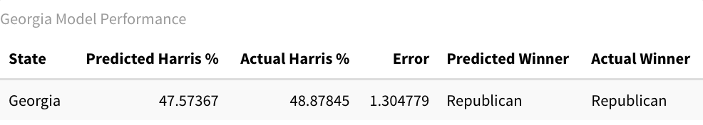
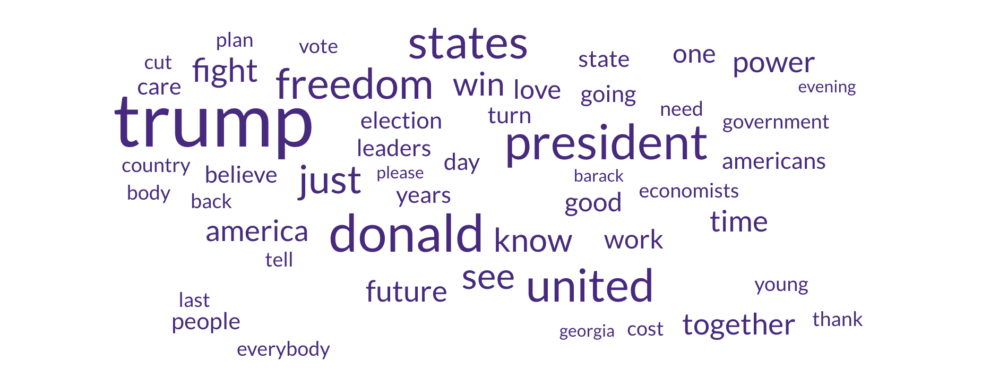
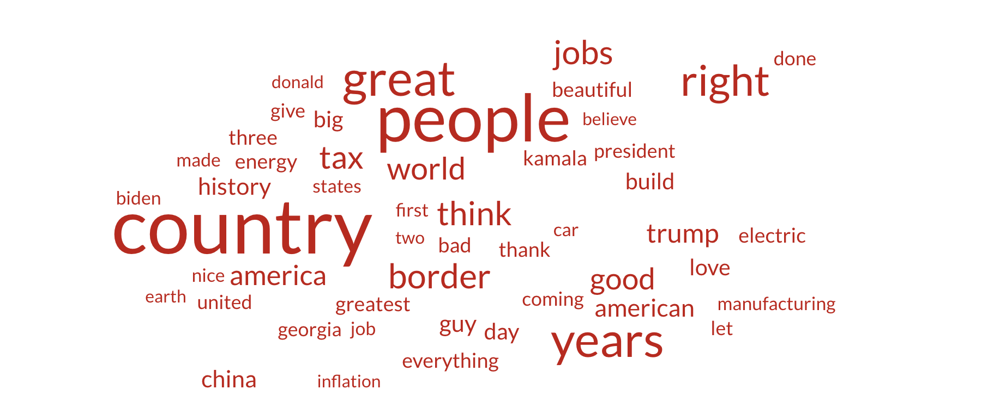
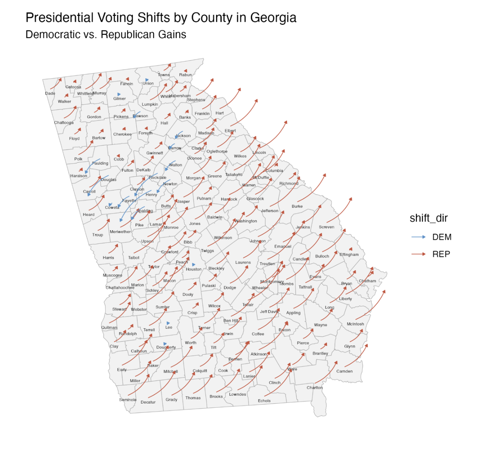

# **Post-Election Campaign Narrative**

**Monday, December 10, 2024**\
**5 Weeks since Presidential Election**

*For my final blog post, I will be analyzing how the Trump and Harris campaigns performed in Georgia. My model predicted a Trump win in the state, like many others. How did Trump appeal to more Georgians than Harris?*

## GOV 1347 Went Down to Georgia

*...They were lookin' for a campaign to analyze, or however the Charlie Daniels song goes.*

My home state of Georgia has received an absurd amount of campaign attention in the past two elections. This is a relatively new phenomenon: the state that I known for the majority of my life had been safely red. In this section, I will explore the conditions of the state and get at why it is such a competitive political landscape for presidential elections.

### Geography

Georgia, a state in the heart of the American South, has five distinct geographic regions: the Appalachian Plateau, Valley and Ridge, Blue Ridge, Piedmont, and Coastal Plain. Most Georgians live in the Piedmont region, which includes the Atlanta metropolitan area (Usery 2003). Over half of the state's population live in the Atlanta Metro Area.

### Demographics

As of the 2020 Census, 10.7 million people live in Georgia (U.S. Census Bureau, "Race", 2020). 11.6% of Georgia's residents are foreign born and 15.7% of Georgians speak a language other than English at home; these percentages are lower than they are for the U.S. as a whole (U.S. Census Bureau, "Language Spoken at Home", 2023). The median household income in Georgia is also slightly less than the national median, at around \$74,500 (U.S. Census Bureau, "Income in the Past 12 Months", 2023). The population of Georgians with a Bachelor's Degree or higher is also about a percent lower than it is for the nation (U.S. Census Bureau, "Educational Attainment", 2023). White Georgians make up about half the state's population. There are over three million Georgians who are Black and over one million who are Hispanic or Latino. About half a million Asians live in the state, concentrated heavily in suburban Atlanta county of Gwinnett (U.S. Census Bureau, "Race", 2020).

### Down-Ballot Candidates

The current governor for the state is Brian Kemp, a Republican who has held the office since 2019. Kemp, who had formerly been a vocal supporter of the former President Donald Trump, had fended off his efforts to overturn the result of Georgia's 2020 election, which Democrats won. At a campaign event as recent as August of this year, Trump hurled ad hominem attacks against the popular incumbent governor. By October, his campaign likely realized this to be a poor strategic move, and Trump publicly praised how the Governor handled Hurricane Helene (Gringlas 2024).

Georgia has two Democratic Senators, Jon Ossoff and Raphael Warnock, who both entered office in 2021. A Quinnipac University Poll from June 2024 reported approval ratings of 47% and 48% for Ossoff and Warnock, respectively (Quinnipiac University Poll 2024). They were not up for reelection this year.

There were no statewide elections in Georgia this year. Some other relevant races this year included those for the offices of Fulton County District Attorney, State Senate Seat 48, and U.S. House of Representatives for District 2. Two of these offices were on my ballot this year. The Fulton County District Attorney race was not close: incumbent Fani Willis won over 68% of the vote (Ballotopedia, "Municipal Elections in Fulton County, Georgia", 2024). I bring up its relevance in relation to the Trump campaign, which had brought scrutiny upon her for calling a criminal investigation into Trump's efforts to overturn the Presidential Election results in 2020. The State Senate for District 48 involved Republican incumbent Shawn Still, who was indicted for involvement in the Trump fake elector scheme, and Democrat Ashwin Ramaswami, a 25 year-old Georgetown Law graduate. Ramaswami accepted over \$700k in donations, holding fundraising events in Palo Alto and New York in addition to his home state (Joyner 2024). After a campaign that included advertising that called Ramaswami an "extremist" and "creepy", he lost the election by more than 6 points (Ramaswami 2024; Ballotopedia, "Aswhin Ramaswami"). The race for Georgia's Congressional District 2 was the closest of all congressional races this year, but the incumbent Democrat Stanford Bishop Jr. won his reelection (Ballotopedia, "Georgia's 2nd Congressional District").

### Electoral History

One of the thirteen original colonies, Georgia's place has remained a key figure in securing the presidency throughout American history. From 1972 to 2016, Georgia has remained safely Republican, except for when Jimmy Carter ran or when Bill Clinton ran for the first time. Carter is a Georgia native, and Clinton is a Southern Democrat. Much to the amazement of the nation, Joe Biden was able to flip Georgia in 2020 and won the state by a margin of .2% (270toWin, "Georgia"). Since 2003, Georgia has only had Republican governors, but before then, Democrats held on to the office, going back to the Jim Crow Era.

I would be remiss to overlook the history of racial violence inflicted on Black Georgians in this discussion of our electoral history. White supremacists employed communal violence in the form of lynchings and race riots to scare Black Georgians away from voting. The second and third comings of the Ku Klux Klan, a white supremacist terrorist group, took place in Stone Mountain, Georgia. Jim Crow and Segregation-era policies used legal loopholes to implicitly enforce racial barriers to voting. Now exist racially disparate policies, like heightened requirements on absentee ballot requests and the infamous ban on food and water being given to voters in line at polling stations (SPLC 2021).

## Peach Perfect: How My Model and Others Accurately Forecasted Georgia

My model and FiveThirtyEight's model accurately forecasted that Georgia's 16 electoral votes would go to the Republicans. You can see a tabulation of my model's prediction below:

FiveThirtyEight's model predicted a Trump win of the state in 595 out of 1000 simulations. This prediction was last updated at 6 AM on November 5th, or the morning of Election Day. According to the FiveThirtyEight website, their model uses polling, economic, and demographic inputs. While I also used polling and economic data, my model differed in that I included past vote behavior in the form of vote lags and did not include demographics. I predicted that Harris would rack up about 47.57% of the vote in Georgia (two-party vote share), and G. Elliot Morris's model predicted something similar: 49.4% (Morris 2024). He was a bit closer to the actual Harris vote share in Georgia, which was a multiparty vote share of 48.5% according to RealClearPolitics (RCP 2024). I recalculated the final vote outcome to get Harris's actual two-party vote share, and it came out to be 48.9%.

RCP's prediction, which is just a simple average of polls from October 20 to to November 4, was 47.8% for Harris's vote share. Some medium between the RCP average and Morris's prediction would have been incredibly accurate to the final vote results for Georgia. Notably, my model, which used LASSO, economic indicators, and polling data, was quite similar to RCP's simple average.

It is interesting that a polls-only model actually underpredicted Harris's actual performance in Georgia. In the last blog post, I discussed how a problem with overweighting polling data is that it might overlook a Trump effect where nonresponse bias is more likely among Trump voters. This does not seem to ring true in Georgia. Also, my model had a much lower error for Georgia than any other battleground state; it was best able to predict the vote share in Georgia compared to all other swing states. In class discussions, we noticed how polling in Georgia tends to be more accurate than other states. To draw from my last post: perhaps Georgia polls were just better. An analysis by ABC's FiveThirtyEight, however, shows that, while Georgia polls are more accurate than a lot of the nation (especially since 2016), they are pretty similar in error to Arizona and Nevada polls. Errors of polls in Michigan and Wisconsin, though, were notably higher than Georgia's (Rakich 2024).

So, polling does not tell the entire story. This makes sense when we see that the Morris model actually outperforms the RCP average. At the same time, it is a testament to just how powerful and determinative (though perhaps not wholly) polling data is in a state like Georgia.

## Dawg Fight: Trump and Harris Battle It Out For Georgia Voters

From August 23rd to Election Day, the Trump and Harris campaigns held 27 in-person campaign events in Georgia. 15 of those events, ranging from rallies to roundtables to town halls to restaurant visits, were organized by the Harris/Walz campaign, and the rest by the Trump/Vance campaign.

For Harris, by far the most high-profile event she held in the state was a joint event with Bruce Springsteen and former President Barack Obama in Atlanta on October 24th in Clarkston, an Atlanta suburb (The White House 2024). To get a sense of the issues she discussed in her remarks, I generated a word cloud, which I include below:

It seems the issue she spoke most on that night was Donald Trump. Harris also focused on the economy a good bit. Though it does not show up on the word cloud, she also focused on women's reproductive rights. The rest of the speech seems to broadly call for the unity and moving forward together as a country.

Trump held a large rally in Savannah about a month prior (Gomez Licon 2024). He was on stage for over an hour and twenty minutes. For his speech, I also generated a word cloud:

By contrast to Harris, Trump did not mention his opposition nearly as much as she did. Instead, he focused on the economy and national pride. Trump, with the time he had, was able to go into the economy with great detail, addressing specific industries and his tariff plans. Interestingly, he spoke quite a bit about the border; Georgia is not a border state, but it is estimated that the state has the 8th most unauthorized immigrants (Baker & Warren 2024).

The Wesleyan Media Project found that Harris vastly outspent Trump on social media ads per data from Meta. In the 10 weeks leading up to the election, the Harris campaign spent about \$5.2 million on advertisements on Meta platforms (Facebook and Instagram); the Trump campaign spent about \$900k (Creative 2024). Across most media markets in Georgia, including the Atlanta media market, the Republican party aired more ads than the Democrats with sizable advantages in the Savannah, Augusta, and Macon markets. The Columbus, GA and Chattanooga, TN (across GA and TN) media markets are the only ones in the state that had a Democratic lead in the number of ads aired from July 22nd to October 27th (Wesleyan Media Project 2024).

## Theorizing Harris's Loss

I will evaluate this year's presidential campaigns in Georgia through two frameworks: Lynn Vavreck's Insurgent-Clarifying typology and David Hopkin's urban-rural party divide.

Vavreck argues that campaigns fall into two buckets in a given race. The clarifying campaign is either an incumbent when the economy is generally agreed to be strong or a challenger when the economy is performing poorly; the insurgent campaign is either an incumbent when the economy is generally agreed to be poor or a challenger when the economy is strong (Vavreck 2009, p. 33). I argue that the Harris campaign was an insurgent campaign because popular sentiment around the economy was negative (even if certain economic indicators showed otherwise). In light of this, Vavreck argues that, for the Trump campaign to be successful, it needed to belabor the point of the state of the economy. For the Harris campaign to be successful, it needed to figure out an issue on which she benefited from public opinion more than Trump, preferably an issue that is "lop-sided" in public sentiment. We know that Trump acted in line with Vavreck's advice in Georgia; his speech in Savannah that we analyzed earlier, mentioned manufacturing jobs, tariffs, inflation. It is clear he made an effort to talk about the economy more than Harris and highlight it as her weakness. The Harris campaign, on the other hand, played into Trump's hand of the economy by making it the most discussed issue (other than Trump himself) in the Atlanta rally speech. While it might be important to have a rebuttal, Harris did not nearly focus enough on critical insurgent issues in Georgia like reproductive rights or gun control (68% of Georgians in 2022 supported some form of restrictions on gun ownership (11Alive 2022). By Vavreck's theory, Harris failed to capture a significant opportunity in Georgia and possibly lost as a result. My model overpredicted for Harris's vote share likely because it used objective economic indicators instead of measures of voters' economic sentiment. The Harris campaign could have also fallen into this trap of valuing the economic indicators over public opinion.

Hopkin's urban-rural party divide is essentially this: "The increasingly lopsided Democratic alignment of populous metropolitan areas have helped to push the states where they contain a majority of the electorate into the Democratic column in national elections, while the growing preference of the inhabitants of smaller communities for Republican candidates has likewise contributed to a countervailing shift elsewhere in the nation" (Hopkins 2017, p. 194). He argues that it is not as simple as states being aligned with certain parties; if you look within a state, there can be great regional different in voting patterns. For a swing state like Georgia, this regional difference and how much the candidates are able to play into that can make an election. The Harris campaign playing into the strength of the Democratic Party in urban areas would be in line with Hopkin's. Below is a visualization of the party vote share shifts from the 2020 election to 2024:

It is clear that the Harris campaign was not able to get out its voters in the major counties of the Atlanta Metropolitan Area (Fulton, Cobb, Gwinnett, Clayton, and Dekalb). South Metro Atlanta counties, however, shifted leftward in a phenomenon that was not just unique in Georgia but the nation. Trump was able to do well in all rural counties and secure improvements in Republican vote share between 2020 and 2024. Though many of Harris's campaign events did occur in Metro Atlanta (or other significant metro areas in the state), she did not perform as well as she needed to in such counties. I argue that Hopkin's theory of Democratic alignment of urban areas might face some reckoning in the next decade: Republicans are aiming at Democratic-led cities and their local issues to persuade voters away from the party at the national level as well (Chidi 2024). Thus far, it is hard to tell whether frustration with local issues in Democratic cities translate into votes for the Republican Party.

## Conclusion

The Harris campaign was unable to perform in Georgia. Despite its lead in events on the ground in the state and the stark lead in social media advertisements, it could not get Georgians to keep their state blue from the past election. I theorize that this is because the Harris campaign did not adequately run an insurgent campaign, by identifying and belaboring a lop-sided issue that Georgians care about that was not the economy. Another possible narrative is that Republican attacks on Democratic-led cities could have persuaded some metropolitan voters toward Trump at the national level. Hindsight bias might compel us to believe that Harris led a poor campaign and that is why she lost Georgia's 16 electoral votes to Trump. I do not believe this to be true: the Harris campaign was able to put up a strong fight in Georgia, using digital advertising, celebrity endorsements, and in-person events to its advantage. Honestly, my model likely undershot Harris's two-party vote share because of its overreliance on polling and lack of involvement of any campaign behaviors: spending, advertisements, etc. This qualitative analysis has taught me that I should involve some campaign performance indicators in future forecasts.

As I take my work from this blog to future endeavors in politics, I hope to scrutinize the discrepancy between public opinion on the state of affairs and data on those affairs. I hope this is also a realization of political campaigns from this election year who might have placed too much weight on quantitative data and not general sentiment.

I thank you for following along through this blog for the past three months.

## Sources

Baker, Bryan, and Robert Warren. *Estimates of the Unauthorized Immigrant Population Residing in the United States: January 2018–January 2022*. Office of Homeland Security Statistics, U.S. Department of Homeland Security, Apr. 2024.

Ballotpedia. "Ashwin Ramaswami." *Ballotpedia*, <https://ballotpedia.org/Ashwin_Ramaswami>.

Ballotpedia. "Municipal Elections in Fulton County, Georgia (2024)." *Ballotpedia*, 2024, [https://ballotpedia.org/Municipal_elections_in_Fulton_County,\_Georgia\_(2024)](https://ballotpedia.org/Municipal_elections_in_Fulton_County,_Georgia_(2024)).

Ballotpedia. "Georgia's 2nd Congressional District." *Ballotpedia*, 2024, <https://ballotpedia.org/Georgia%27s_2nd_Congressional_District>.

Chidi, George. "City of Villains: Republicans Stoke Fears of Democratic-Run Cities." *The Guardian*, 6 Oct. 2024, <https://www.theguardian.com/us-news/ng-interactive/2024/oct/06/election-republican-democrat-cities>.

Creative: Cross-Platform Election Advertising Transparency Initiative. "Total Presidential Election Ad Spending on Meta by State." 2024, <https://geo-ad-spending-813751399605.us-central1.run.app/>.

"Georgia." *270toWin*, <https://www.270towin.com/states/Georgia>.

Gomez Licon, Adriana. "WATCH: Trump Talks Tariffs and Taking Other Countries’ Jobs but Offers Few Details." *Associated Press*, 24 Sept. 2024, <https://www.pbs.org/newshour/politics/watch-live-trump-delivers-campaign-remarks-in-savannah-ga>.

Gringlas, Sam. "In a Razor-Thin Race, Trump's Complicated Ties with Georgia's Governor Could Matter." *NPR*, 29 Oct. 2024, <https://www.npr.org/2024/10/28/nx-s1-5168017/2024-election-georgia-donald-trump-brian-kemp>.

Hopkins, David A. *Red Fighting Blue: How Geography and Electoral Rules Polarize American Politics*. Cambridge: Cambridge University Press, 2017.

Joyner, Tammy. "Ashwin Ramaswami Georgia Senate 2024 Election." *State Affairs*, 2024, <https://pro.stateaffairs.com/ga/elections/ashwin-ramaswami-georgia-senate-2024-election>.

Morris, G. Elliot. "Who Is Favored to Win Georgia’s 16 Electoral Votes?" *FiveThirtyEight*, 5 Nov. 2024, <https://projects.fivethirtyeight.com/2024-election-forecast/georgia/>.

Quinnipiac University Poll. "Georgia 2024: Trump Ahead of Biden." *Quinnipiac University Poll*, 5 Jun. 2024, <https://poll.qu.edu/poll-release?releaseid=3899>.

Rakich, Nathaniel. "Which States Have the Most—and Least—Accurate Polls?" *FiveThirtyEight*, 25 Oct. 2024, <https://abcnews.go.com/538/states-accurate-polls/story?id=115108709>.

Ramaswami, Ashwin. "I'm Going Public with Shawn Still's Racist Activity." *LinkedIn*, Oct. 2024, <https://www.linkedin.com/posts/ashwin-r_im-going-public-with-shawn-stills-racist-activity-7252781240129323009-Cefr>.

RealClearPolling (RCP). "Trump vs. Harris: 2024 Presidential Election in Georgia." *RealClearPolling*, <https://www.realclearpolling.com/polls/president/general/2024/georgia/trump-vs-harris>.

Southern Poverty Law Center (SPLC). "Same Old Jim Crow: Georgia Voter Law Continues Long History of Disenfranchisement." *Southern Poverty Law Center*, 23 Apr. 2021, <https://www.splcenter.org/news/2021/04/23/same-old-jim-crow-georgia-voter-law-continues-long-history-disenfranchisement>.

The White House. "Remarks by Vice President Harris at a Campaign Event, Clarkston, GA." *The White House*, 24 Oct. 2024, <https://www.whitehouse.gov/briefing-room/speeches-remarks/2024/10/24/remarks-by-vice-president-harris-at-a-campaign-event-clarkston-ga/>.

U.S. Census Bureau. "RACE." Decennial Census, DEC 118th Congressional District Summary File, Table P8, 2020, <https://data.census.gov/table/DECENNIALCD1182020.P8?g=040XX00US13.>

U.S. Census Bureau, U.S. Department of Commerce. "Educational Attainment." American Community Survey, ACS 1-Year Estimates Subject Tables, Table S1501, 2023, <https://data.census.gov/table/ACSST1Y2023.S1501?g=040XX00US13.>

U.S. Census Bureau, U.S. Department of Commerce. "Income in the Past 12 Months (in 2023 Inflation-Adjusted Dollars)." American Community Survey, ACS 1-Year Estimates Subject Tables, Table S1901, 2023, <https://data.census.gov/table/ACSST1Y2023.S1901?g=040XX00US13.>

U.S. Census Bureau, U.S. Department of Commerce. "Language Spoken at Home." American Community Survey, ACS 1-Year Estimates Subject Tables, Table S1601, 2023, <https://data.census.gov/table/ACSST1Y2023.S1601?g=040XX00US13.>

Usery, E. "Geographic Regions of Georgia." New Georgia Encyclopedia, 18 July 2003, <https://www.georgiaencyclopedia.org/articles/geography-environment/geographic-regions-of-georgia-overview/>.

Vavreck, Lynn. *The Message Matters: The Economy and Presidential Campaigns.* Course Book ed. Princeton University Press, 2009. *Project MUSE*, [https://muse.jhu.edu/book/36264](https://muse-jhu-edu.ezp-prod1.hul.harvard.edu/book/36264).

Wesleyan Media Project. "More Than \$4.5 Billion in Ad Spending This Cycle." *Wesleyan Media Project*, 31 Oct. 2024, <https://mediaproject.wesleyan.edu/releases-103124/>.

11Alive. "11Alive Poll \| Georgia Voters Support Gun-Buyer Background Checks, 'Red Flag' Laws." *11Alive*, 28 July 2022, <https://www.11alive.com/article/news/local/poll-georgia-voters-guns/85-683791f7-f89b-4dda-bd96-54bf2469661e>.
